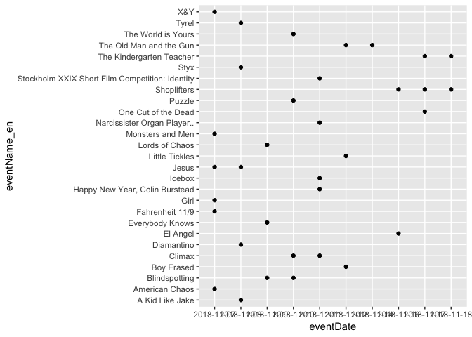

Class1
================

``` r
library(tidyverse)
```

    ## -- Attaching packages --------------------------------------- tidyverse 1.2.1 --

    ## <U+221A> ggplot2 3.0.0     <U+221A> purrr   0.2.5
    ## <U+221A> tibble  1.4.2     <U+221A> dplyr   0.7.6
    ## <U+221A> tidyr   0.8.1     <U+221A> stringr 1.3.1
    ## <U+221A> readr   1.1.1     <U+221A> forcats 0.3.0

    ## -- Conflicts ------------------------------------------ tidyverse_conflicts() --
    ## x dplyr::filter() masks stats::filter()
    ## x dplyr::lag()    masks stats::lag()

``` r
library(tidyr)
library(knitr)
library(ggplot2)
```

``` r
Sortiment_hela <- read.csv("Class_files/systembolaget2018-10-08.csv")
#head(Sortiment_hela)

Sortiment_ord <- Sortiment_hela %>%
  mutate(Alkoholhalt = as.numeric(gsub("%","",Alkoholhalt))/100) %>%
  mutate(Varugrupp = ifelse(Varugrupp=="Röda", "Rött vin", ifelse(Varugrupp=="Vita", "Vitt vin", levels(Varugrupp)))) %>%
  filter(SortimentText == "Ordinarie sortiment")
#head(Sortiment_ord)

PrisMax <- Sortiment_hela %>%
  filter(PrisPerLiter == max(PrisPerLiter)) %>%
  select(Namn)
PrisMax
```

    ##            Namn
    ## 1 Highland Park

``` r
Expensive <- Sortiment_ord %>%
  arrange(desc(PrisPerLiter)) %>%
  slice(1:10) %>%
  select(Namn, PrisPerLiter, Varugrupp, Alkoholhalt)
kable(Expensive, format = "html")
```

<table>
<thead>
<tr>
<th style="text-align:left;">
Namn
</th>
<th style="text-align:right;">
PrisPerLiter
</th>
<th style="text-align:left;">
Varugrupp
</th>
<th style="text-align:right;">
Alkoholhalt
</th>
</tr>
</thead>
<tbody>
<tr>
<td style="text-align:left;">
Highland Park
</td>
<td style="text-align:right;">
5707.14
</td>
<td style="text-align:left;">
Smaksatt vin
</td>
<td style="text-align:right;">
0.457
</td>
</tr>
<tr>
<td style="text-align:left;">
Hennessy
</td>
<td style="text-align:right;">
2141.43
</td>
<td style="text-align:left;">
Anissprit
</td>
<td style="text-align:right;">
0.400
</td>
</tr>
<tr>
<td style="text-align:left;">
Krug
</td>
<td style="text-align:right;">
2132.00
</td>
<td style="text-align:left;">
Calvados
</td>
<td style="text-align:right;">
0.120
</td>
</tr>
<tr>
<td style="text-align:left;">
Cuv<c3><a9>e Sir Winston Churchill
</td>
<td style="text-align:right;">
1933.33
</td>
<td style="text-align:left;">
Ros<c3><a9>vin
</td>
<td style="text-align:right;">
0.125
</td>
</tr>
<tr>
<td style="text-align:left;">
The Glenlivet
</td>
<td style="text-align:right;">
1927.14
</td>
<td style="text-align:left;">
Rom
</td>
<td style="text-align:right;">
0.430
</td>
</tr>
<tr>
<td style="text-align:left;">
Dom P<c3><a9>rignon
</td>
<td style="text-align:right;">
1898.67
</td>
<td style="text-align:left;">
Bitter
</td>
<td style="text-align:right;">
0.125
</td>
</tr>
<tr>
<td style="text-align:left;">
Glengoyne
</td>
<td style="text-align:right;">
1855.71
</td>
<td style="text-align:left;">
Sprit av flera typer
</td>
<td style="text-align:right;">
0.430
</td>
</tr>
<tr>
<td style="text-align:left;">
Kavalan
</td>
<td style="text-align:right;">
1855.71
</td>
<td style="text-align:left;">
Vin av flera typer
</td>
<td style="text-align:right;">
0.586
</td>
</tr>
<tr>
<td style="text-align:left;">
Diplom<c3><a1>tico
</td>
<td style="text-align:right;">
1812.86
</td>
<td style="text-align:left;">
Smaksatt sprit
</td>
<td style="text-align:right;">
0.430
</td>
</tr>
<tr>
<td style="text-align:left;">
Jura
</td>
<td style="text-align:right;">
1712.86
</td>
<td style="text-align:left;">
Smaksatt sprit
</td>
<td style="text-align:right;">
0.440
</td>
</tr>
</tbody>
</table>
``` r
ggplot(Sortiment_ord, aes(x = Alkoholhalt, y = PrisPerLiter, color = Varugrupp)) + 
  geom_point() + 
  scale_y_log10()
```


``` r
ggplot(Sortiment_ord, aes(x = Varugrupp, y = PrisPerLiter)) + 
  geom_point() + 
  scale_y_log10() + 
  coord_flip()
```


``` r
Sortiment_ord %>%
  filter(Varugrupp %in% c("Vitt vin", "R\303\266tt vin", "Ros\303\251vin", "Mousserande vin"), Argang %in% c(2010:2017)) %>%
  ggplot(aes(x = Argang, y = PrisPerLiter, color = Varugrupp)) + geom_point()
```


``` r
Sortiment_ord %>%
  filter(Varugrupp %in% c("Vitt vin", "R\303\266tt vin", "Ros\303\251vin", "Mousserande vin"), Argang %in% c(2010:2017)) %>%
  ggplot(aes(x = Argang, y = PrisPerLiter)) + geom_point() + facet_wrap(~ Varugrupp)
```


``` r
Film <- read.csv("Class_files/Film_events_2018-11-07.csv")
FilmSO <- Film %>%
  filter(eventTicketStatus=="soldout")
Film %>% 
  group_by(venueId) %>% 
  mutate(N=n()) %>%
  ungroup() %>% 
  filter(N==max(N)) %>%
  slice(1) %>%
  select(venueName)
```

    ## # A tibble: 1 x 1
    ##   venueName
    ##   <fct>    
    ## 1 Sture 1

``` r
ggplot(FilmSO, aes(x = eventDate, y = eventName_en)) + geom_point() 
```



``` r
winter_medals <- read.csv("Class_files/Winter_medals2018-09-26.csv")
head(winter_medals)
```

    ##     Country Year Gold Silver Bronze Total Country.Code Population
    ## 1 Australia 1994    0      0      1     1          AUS   17855000
    ## 2 Australia 1998    0      0      1     1          AUS   18711000
    ## 3 Australia 2002    2      0      0     2          AUS   19651400
    ## 4 Australia 2006    1      0      1     2          AUS   20697900
    ## 5 Australia 2010    2      1      0     3          AUS   22031750
    ## 6 Australia 2014    0      2      1     3          AUS   23460694

``` r
winter_medals <- winter_medals %>%
  mutate(medals_per_mill = 1000000*Total/Population)

winter_medals %>%
  filter(Year == 2018) %>%
  arrange(desc(medals_per_mill)) %>%
  slice(1:10)
```

    ##           Country Year Gold Silver Bronze Total Country.Code Population
    ## 1   Liechtenstein 2018    0      0      1     1          LIE      38239
    ## 2          Norway 2018   14     14     11    39          NOR    5346471
    ## 3     Switzerland 2018    5      6      4    15          CHE    8563280
    ## 4         Austria 2018    5      3      6    14          AUT    8881705
    ## 5          Sweden 2018    7      6      1    14          SWE   10090155
    ## 6     Netherlands 2018    8      6      6    20          NLD   17141500
    ## 7         Finland 2018    1      1      4     6          FIN    5538940
    ## 8        Slovenia 2018    0      1      1     2          SVN    2069074
    ## 9          Canada 2018   11      8     10    29          CAN   37023087
    ## 10 Czech Republic 2018    2      2      3     7          CZE   10585012
    ##    medals_per_mill
    ## 1       26.1513115
    ## 2        7.2945313
    ## 3        1.7516652
    ## 4        1.5762739
    ## 5        1.3874911
    ## 6        1.1667590
    ## 7        1.0832398
    ## 8        0.9666160
    ## 9        0.7832950
    ## 10       0.6613124

``` r
medals_SNF <- winter_medals %>%
  filter(Country %in% c("Sweden", "Norway", "Finland"))

ggplot(medals_SNF, aes(x = Year, y = Total, shape = Country, color = Country)) + 
  geom_point() + 
  facet_wrap(~ Country)
```


``` r
medals_Swe <- winter_medals %>%
  filter(Country == "Sweden") %>%
  select(Year, Gold, Silver, Bronze)
total_medals_Swe <- gather(medals_Swe, Medals, value, -Year)
ggplot(total_medals_Swe, aes(x = Year, y = value, color = Medals)) + 
  geom_point() +
  scale_color_manual(breaks = c("Gold", "Silver", "Bronze"), values=c("goldenrod3", "gold", "gray75")) +
  ylab("Medals") 
```


``` r
total_medals_SNF <- medals_SNF %>%
  select(Country, Year, Gold, Silver, Bronze) %>%
  gather(Medals, value, -Year, - Country)
ggplot(total_medals_SNF, aes(x = Year, y = value, color = Medals)) + 
  geom_point() +
  scale_color_manual(breaks = c("Gold", "Silver", "Bronze"), values=c("goldenrod3", "gold", "gray75")) +
  ylab("Medals") +
  facet_wrap(~ Country)
```


