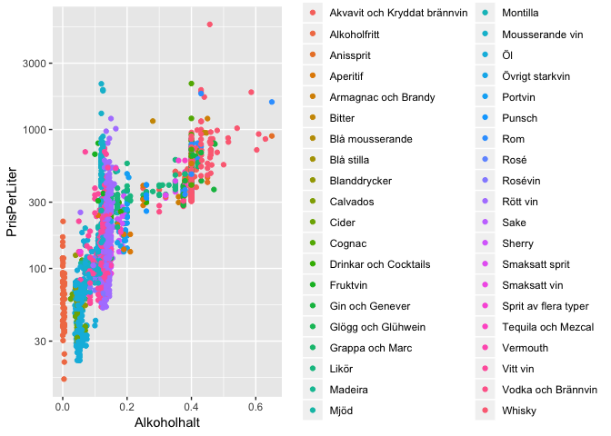
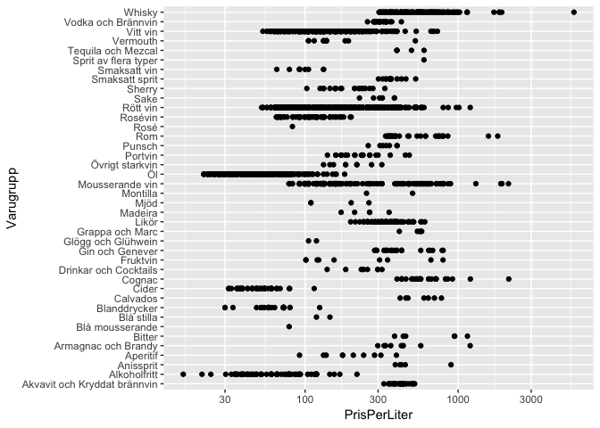
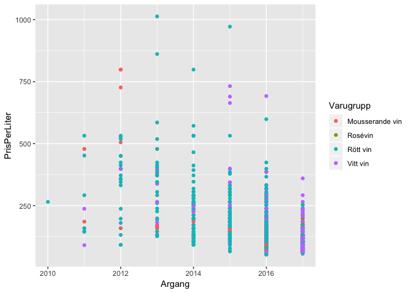
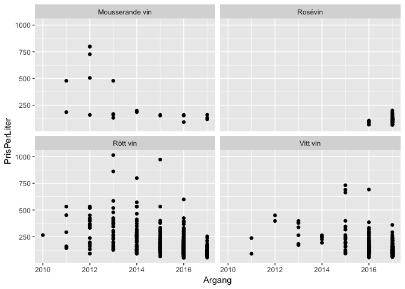
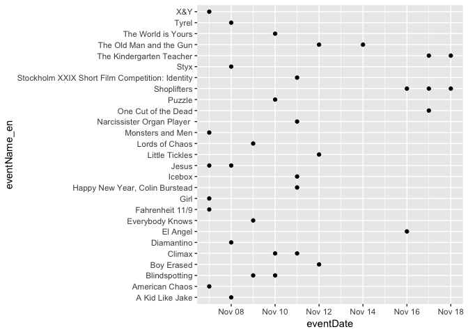
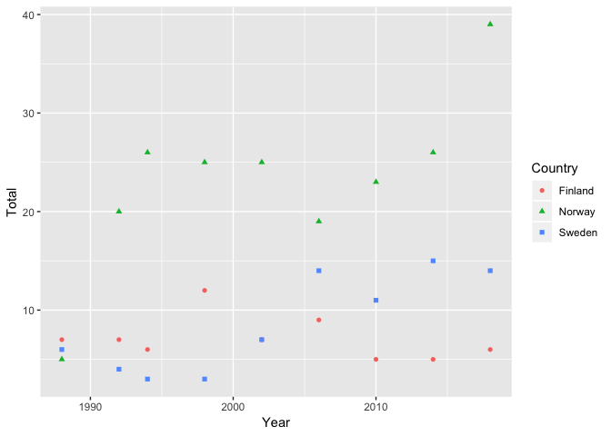
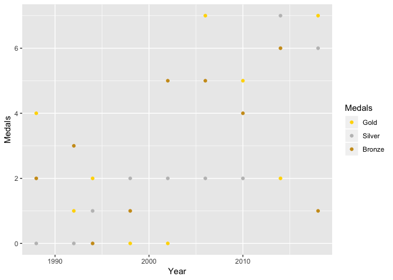
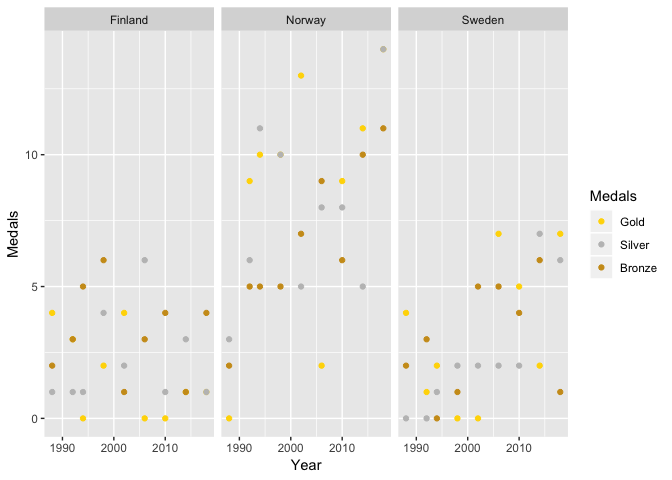

Class 2: Tidyverse: Basic dplyr and ggplot2
================

Nga Nguyen

``` r
library(tidyverse)
```

    ## ── Attaching packages ──────────────────────────────────────────────────────────────────────── tidyverse 1.2.1 ──

    ## ✔ ggplot2 3.0.0     ✔ purrr   0.2.5
    ## ✔ tibble  1.4.2     ✔ dplyr   0.7.6
    ## ✔ tidyr   0.8.1     ✔ stringr 1.3.1
    ## ✔ readr   1.1.1     ✔ forcats 0.3.0

    ## ── Conflicts ─────────────────────────────────────────────────────────────────────────── tidyverse_conflicts() ──
    ## ✖ dplyr::filter() masks stats::filter()
    ## ✖ dplyr::lag()    masks stats::lag()

``` r
library(tidyr)
library(knitr)
library(ggplot2)
```

Systembolaget’s assortment
==========================

Exercises (training of arrange, filter, mutate, select, %&gt;%)
---------------------------------------------------------------

Systembolaget’s assortment of beverages from 2018-10-18 is available in the file Class\_files/systembolaget2018-10-08.csv. It is downloaded from Systembolaget’s public API and saved in csv-format by the script Class\_files/Systembolaget.R. Load its contents by

``` r
Sortiment_hela <- read_csv("Class_files/systembolaget2018-10-08.csv")
```

    ## Parsed with column specification:
    ## cols(
    ##   .default = col_character(),
    ##   nr = col_integer(),
    ##   Artikelid = col_integer(),
    ##   Varnummer = col_integer(),
    ##   Prisinklmoms = col_double(),
    ##   Volymiml = col_double(),
    ##   PrisPerLiter = col_double(),
    ##   Saljstart = col_date(format = ""),
    ##   Utgått = col_integer(),
    ##   Argang = col_integer(),
    ##   Ekologisk = col_integer(),
    ##   Etiskt = col_integer(),
    ##   Koscher = col_integer(),
    ##   Pant = col_double()
    ## )

    ## See spec(...) for full column specifications.

``` r
glimpse(Sortiment_hela)
```

    ## Observations: 17,591
    ## Variables: 30
    ## $ nr                 <int> 101, 7548901, 7774701, 7563901, 7521801, 89...
    ## $ Artikelid          <int> 1, 1000008, 1000080, 1000083, 1000131, 1000...
    ## $ Varnummer          <int> 1, 75489, 77747, 75639, 75218, 89366, 87805...
    ## $ Namn               <chr> "Renat", "Valtellina Superiore", "Canella",...
    ## $ Namn2              <chr> NA, "Sassella Riserva", "Valdobbiadene Pros...
    ## $ Prisinklmoms       <dbl> 204.0, 339.0, 147.0, 159.0, 181.0, 26.7, 37...
    ## $ Volymiml           <dbl> 700, 750, 750, 750, 750, 330, 700, 1000, 70...
    ## $ PrisPerLiter       <dbl> 291.43, 452.00, 196.00, 212.00, 241.33, 80....
    ## $ Saljstart          <date> 1993-10-01, 2015-09-01, 2015-09-01, 2015-0...
    ## $ Utgått             <int> 0, 0, 0, 0, 0, 0, 0, 0, 0, 0, 0, 0, 0, 0, 0...
    ## $ Varugrupp          <chr> "Vodka och Brännvin", "Rött vin", "Moussera...
    ## $ Typ                <chr> "Vodka", NA, "Vitt Torrt", "Fylligt & Smakr...
    ## $ Stil               <chr> NA, NA, NA, NA, NA, "Modern stil", NA, NA, ...
    ## $ Forpackning        <chr> "Flaska", "Flaska", "Flaska", "Flaska", "Fl...
    ## $ Forslutning        <chr> NA, NA, NA, "Natur", NA, NA, NA, NA, NA, "B...
    ## $ Ursprung           <chr> NA, "Lombardiet", "Venetien", "Rioja", NA, ...
    ## $ Ursprunglandnamn   <chr> "Sverige", "Italien", "Italien", "Spanien",...
    ## $ Producent          <chr> "Pernod Ricard", "Arpepe", "Canella SpA", "...
    ## $ Leverantor         <chr> "Pernod Ricard Sweden AB", "Vinoliv Import ...
    ## $ Argang             <int> NA, 2011, 2014, 2006, 2015, NA, NA, NA, NA,...
    ## $ Provadargang       <chr> NA, NA, NA, NA, NA, NA, NA, NA, NA, NA, NA,...
    ## $ Alkoholhalt        <chr> "37.50%", "13.50%", "11.00%", "12.00%", "13...
    ## $ Sortiment          <chr> "FS", "BS", "BS", "BS", "BS", "BS", "BS", "...
    ## $ SortimentText      <chr> "Ordinarie sortiment", "Övrigt sortiment", ...
    ## $ Ekologisk          <int> 0, 0, 0, 0, 0, 0, 0, 0, 0, 0, 0, 0, 0, 0, 0...
    ## $ Etiskt             <int> 0, 0, 0, 0, 0, 0, 0, 0, 0, 0, 0, 0, 0, 0, 0...
    ## $ Koscher            <int> 0, 0, 0, 0, 0, 0, 0, 0, 0, 0, 0, 0, 0, 0, 0...
    ## $ RavarorBeskrivning <chr> "Säd.", NA, NA, "Viura.", NA, NA, NA, NA, N...
    ## $ Pant               <dbl> NA, NA, NA, NA, NA, NA, NA, NA, NA, NA, NA,...
    ## $ EtisktEtikett      <chr> NA, NA, NA, NA, NA, NA, NA, NA, NA, NA, NA,...

The variable Alkoholhalt (alcohol by volume) has been classified as character by read\_delim, since it contains a percent sign. Convert it to numeric using mutate by first removing the percent sign (e.g. with gsub) and then transform with as.numeric.

A few wines have been labelled as Röda and Vita instead of Rött vin (red wine) respektive Vitt vin (white wine) in the Varugrupp (group of products) column. Fix this, e.g. by using mutate and ifelse.

``` r
Sortiment_ord <- Sortiment_hela %>%
  mutate(Alkoholhalt = as.numeric(gsub("%","",Alkoholhalt))/100) %>%
  mutate(Varugrupp = ifelse(Varugrupp == "Röda", "Rött vin", ifelse(Varugrupp == "Vita", "Vitt vin", Varugrupp))) %>%
  filter(SortimentText == "Ordinarie sortiment")
#head(Sortiment_ord)
```

What beverage has the highest PrisPerLiter? Display the answer (the Namn of the beverage) as dynamically coded in the text body of your .Rmd-document.

``` r
PrisMax <- Sortiment_hela %>%
  filter(PrisPerLiter == max(PrisPerLiter)) %>%
  select(Namn)
PrisMax
```

    ## # A tibble: 1 x 1
    ##   Namn         
    ##   <chr>        
    ## 1 Highland Park

Create a new data frame Sortiment\_ord with the regular product range (where SortimentText equals Ordinarie sortiment). Make a table (with kable from the knitr-library) of the 10 most expensive (PrisPerLiter) beverages from this range. Use select to select suitable columns for the table.

``` r
Expensive <- Sortiment_ord %>%
  arrange(desc(PrisPerLiter)) %>%
  slice(1:10) %>%
  select(Namn, PrisPerLiter, Varugrupp, Alkoholhalt)
kable(Expensive)
```

| Namn                        |  PrisPerLiter| Varugrupp       |  Alkoholhalt|
|:----------------------------|-------------:|:----------------|------------:|
| Highland Park               |       5707.14| Whisky          |        0.457|
| Hennessy                    |       2141.43| Cognac          |        0.400|
| Krug                        |       2132.00| Mousserande vin |        0.120|
| Cuvée Sir Winston Churchill |       1933.33| Mousserande vin |        0.125|
| The Glenlivet               |       1927.14| Whisky          |        0.430|
| Dom Pérignon                |       1898.67| Mousserande vin |        0.125|
| Glengoyne                   |       1855.71| Whisky          |        0.430|
| Kavalan                     |       1855.71| Whisky          |        0.586|
| Diplomático                 |       1812.86| Rom             |        0.430|
| Jura                        |       1712.86| Whisky          |        0.440|

Exercises (training of ggplot, geom\_point, geom\_line, facet\_wrap)
--------------------------------------------------------------------

Plot PrisPerLiter against Alkoholhalt, color the points by Varugrupp and consider using a log-scale for PrisPerLiter.

``` r
ggplot(Sortiment_ord, aes(x = Alkoholhalt, y = PrisPerLiter, color = Varugrupp)) + 
  geom_point() + 
  scale_y_log10()
```



Plot PrisPerLiter (possibly on a log-scale) against Varugrupp. Consider coord\_flip to improve readability.

``` r
ggplot(Sortiment_ord, aes(x = Varugrupp, y = PrisPerLiter)) + 
  geom_point() + 
  scale_y_log10() + 
  coord_flip()
```



For the groups of products c("Vitt vin", "Rött vin", "Rosévin", "Mousserande vin") of vintage (Argang) 2010-2017, plot PrisPerLiter against Argang. Try both using a facet for each group and coloring by group in the same facet.

``` r
Sortiment_ord %>%
  filter(Varugrupp %in% c("Vitt vin", "Rött vin", "Rosévin", "Mousserande vin"), Argang %in% c(2010:2017)) %>%
  ggplot(aes(x = Argang, y = PrisPerLiter, color = Varugrupp)) + geom_point()
```



``` r
Sortiment_ord %>%
  filter(Varugrupp %in% c("Vitt vin", "Rött vin", "Rosévin", "Mousserande vin"), Argang %in% c(2010:2017)) %>%
  ggplot(aes(x = Argang, y = PrisPerLiter)) + geom_point() + facet_wrap(~ Varugrupp)
```



Further excercises
------------------

Use your imagination and keep exploring the data.

Film events
===========

Stockholm international film festival just started. In Class\_files/Film\_events\_2018-11-07.csv you will find their event schedule as of this morning.

``` r
Film <- read_csv("Class_files/Film_events_2018-11-07.csv")
```

    ## Parsed with column specification:
    ## cols(
    ##   eventId = col_integer(),
    ##   eventNumber = col_integer(),
    ##   eventName_sv = col_character(),
    ##   eventName_en = col_character(),
    ##   eventDate = col_date(format = ""),
    ##   eventTime = col_time(format = ""),
    ##   eventTimestamp = col_integer(),
    ##   eventHasFaceToFace = col_character(),
    ##   filmId = col_integer(),
    ##   partyId = col_character(),
    ##   venueId = col_integer(),
    ##   venueName = col_character(),
    ##   eventTicketStatus = col_character(),
    ##   eventBuyURL = col_character(),
    ##   eventBuyOneTimeURL = col_character(),
    ##   eventModifiedTimestamp = col_integer()
    ## )

Exercises (training of arrange, filter, mutate, select, %&gt;%)
---------------------------------------------------------------

What films are already sold out (for all screenings)?

``` r
FilmSO <- Film %>%
  filter(eventTicketStatus == "soldout")
```

What venue screens the most number of (unique) films?

``` r
Film %>% 
  group_by(venueName) %>% 
  summarize(N = n_distinct(filmId)) %>%
  arrange(desc(N)) %>%
  head(n = 10) %>%
  kable()
```

| venueName         |    N|
|:------------------|----:|
| Sture 1           |   66|
| Sture 2           |   65|
| Sture 3           |   61|
| Skandia           |   57|
| Zita 1            |   33|
| Klarabiografen    |   25|
| Bio Rio           |    9|
| Filmhuset Mauritz |    9|
| Filmhuset Victor  |    5|

Plot the proportion of sold out events for each day of the festival.

``` r
ggplot(FilmSO, aes(x = eventDate, y = eventName_en)) + geom_point() 
```



Olympic winter medals
=====================

The file Class\_files/Winter\_medals2018-09-26.csv contains the number of medals per country and olympic year at the winter olympics since 1980 together with the total population of the country. The data set is scraped from Wikipedia using the script Class\_files/Winter\_medals.R which contains more information, in particular on countries that has been split or joined during the period.

Load the file using

``` r
winter_medals <- read.csv("Class_files/Winter_medals2018-09-26.csv")
glimpse(winter_medals)
```

    ## Observations: 214
    ## Variables: 8
    ## $ Country      <fct> Australia, Australia, Australia, Australia, Austr...
    ## $ Year         <int> 1994, 1998, 2002, 2006, 2010, 2014, 2018, 1988, 1...
    ## $ Gold         <int> 0, 0, 2, 1, 2, 0, 0, 3, 6, 2, 3, 3, 9, 4, 4, 5, 0...
    ## $ Silver       <int> 0, 0, 0, 0, 1, 2, 2, 5, 7, 3, 5, 4, 7, 6, 8, 3, 2...
    ## $ Bronze       <int> 1, 1, 0, 1, 0, 1, 1, 2, 8, 4, 9, 10, 7, 6, 5, 6, ...
    ## $ Total        <int> 1, 1, 2, 2, 3, 3, 3, 10, 21, 9, 17, 17, 23, 16, 1...
    ## $ Country.Code <fct> AUS, AUS, AUS, AUS, AUS, AUS, AUS, AUT, AUT, AUT,...
    ## $ Population   <dbl> 17855000, 18711000, 19651400, 20697900, 22031750,...

Exercises (training of arrange, filter, mutate, select, %&gt;%)
---------------------------------------------------------------

Create a variable column medals\_per\_mill, the number of medals per million inhabitants. Print a table of the 10 most successful countries, by medals\_per\_mill, during the 2018 Winter olympics.

``` r
winter_medals %>%
  mutate(medals_per_mill = 1000000*Total/Population) %>%
  filter(Year == 2018) %>%
  arrange(desc(medals_per_mill)) %>%
  head(n = 10) %>%
  kable()
```

| Country        |  Year|  Gold|  Silver|  Bronze|  Total| Country.Code |  Population|  medals\_per\_mill|
|:---------------|-----:|-----:|-------:|-------:|------:|:-------------|-----------:|------------------:|
| Liechtenstein  |  2018|     0|       0|       1|      1| LIE          |       38239|         26.1513115|
| Norway         |  2018|    14|      14|      11|     39| NOR          |     5346471|          7.2945313|
| Switzerland    |  2018|     5|       6|       4|     15| CHE          |     8563280|          1.7516652|
| Austria        |  2018|     5|       3|       6|     14| AUT          |     8881705|          1.5762739|
| Sweden         |  2018|     7|       6|       1|     14| SWE          |    10090155|          1.3874911|
| Netherlands    |  2018|     8|       6|       6|     20| NLD          |    17141500|          1.1667590|
| Finland        |  2018|     1|       1|       4|      6| FIN          |     5538940|          1.0832398|
| Slovenia       |  2018|     0|       1|       1|      2| SVN          |     2069074|          0.9666160|
| Canada         |  2018|    11|       8|      10|     29| CAN          |    37023087|          0.7832950|
| Czech Republic |  2018|     2|       2|       3|      7| CZE          |    10585012|          0.6613124|

Exercises (training of ggplot, geom\_point, geom\_line, facet\_wrap)
--------------------------------------------------------------------

Plot the total number of medals against year for Sweden, Norway and Finland in the same figure and separate the countries with a suitable aesthetic (see ?geom\_point for a list of aesthetics geom\_point understands).

``` r
medals_SNF <- winter_medals %>%
  filter(Country %in% c("Sweden", "Norway", "Finland"))

ggplot(medals_SNF, aes(x = Year, y = Total, color = Country)) + 
  geom_point(aes(shape = Country))
```



Plot the number of Swedish gold, silver and bronze medals against year (bonus: color the points in gold/silver/bronze).

``` r
medals_Swe <- winter_medals %>%
  filter(Country == "Sweden") %>%
  select(Year, Gold, Silver, Bronze)
total_medals_Swe <- gather(medals_Swe, Medals, value, -Year)
ggplot(total_medals_Swe, aes(x = Year, y = value, color = Medals)) + 
  geom_point() +
  scale_color_manual(breaks = c("Gold", "Silver", "Bronze"), values = c("goldenrod3", "gold", "gray75")) +
  ylab("Medals") 
```



As previous excercise, but with a “facet” for each of Sweden, Norway and Finland.

``` r
total_medals_SNF <- medals_SNF %>%
  select(Country, Year, Gold, Silver, Bronze) %>%
  gather(Medals, value, -Year, - Country)
ggplot(total_medals_SNF, aes(x = Year, y = value, color = Medals)) + 
  geom_point() +
  scale_color_manual(breaks = c("Gold", "Silver", "Bronze"), values=c("goldenrod3", "gold", "gray75")) +
  ylab("Medals") +
  facet_wrap(~ Country)
```



Gapminder
=========

Use ggplot to recreate (static versions) of some figures from Hans Rosling’s talks. Data is available in package gapminder.
