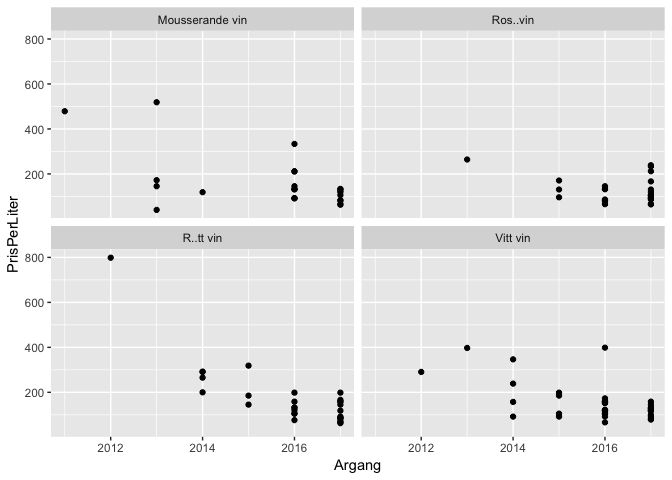

Class1
================

``` r
Sortiment_hela <- read.csv("Class_files/systembolaget2018-10-08.csv")
#head(Sortiment_hela)

Sortiment_ord <- Sortiment_hela %>%
  mutate(Alkoholhalt = as.numeric(gsub("%","",Alkoholhalt))/100) %>%
  mutate(Varugrupp = ifelse(Varugrupp=="Röda", "Rött vin", ifelse(Varugrupp=="Vita", "Vitt vin", levels(Varugrupp)))) %>%
  filter(SortimentText == "Ordinarie sortiment")
#head(Sortiment_ord)

PrisMax <- Sortiment_hela %>%
  filter(PrisPerLiter == max(PrisPerLiter)) %>%
  select(Namn)
PrisMax
```

    ##            Namn
    ## 1 Highland Park

``` r
Expensive <- Sortiment_ord %>%
  arrange(desc(PrisPerLiter)) %>%
  slice(1:10) %>%
  select(Namn, PrisPerLiter, Varugrupp, Alkoholhalt)
kable(Expensive, format = "html")
```

<table>
<thead>
<tr>
<th style="text-align:left;">
Namn
</th>
<th style="text-align:right;">
PrisPerLiter
</th>
<th style="text-align:left;">
Varugrupp
</th>
<th style="text-align:right;">
Alkoholhalt
</th>
</tr>
</thead>
<tbody>
<tr>
<td style="text-align:left;">
Highland Park
</td>
<td style="text-align:right;">
5707.14
</td>
<td style="text-align:left;">
Smaksatt vin
</td>
<td style="text-align:right;">
0.457
</td>
</tr>
<tr>
<td style="text-align:left;">
Hennessy
</td>
<td style="text-align:right;">
2141.43
</td>
<td style="text-align:left;">
Anissprit
</td>
<td style="text-align:right;">
0.400
</td>
</tr>
<tr>
<td style="text-align:left;">
Krug
</td>
<td style="text-align:right;">
2132.00
</td>
<td style="text-align:left;">
Calvados
</td>
<td style="text-align:right;">
0.120
</td>
</tr>
<tr>
<td style="text-align:left;">
Cuv<c3><a9>e Sir Winston Churchill
</td>
<td style="text-align:right;">
1933.33
</td>
<td style="text-align:left;">
Ros<c3><a9>vin
</td>
<td style="text-align:right;">
0.125
</td>
</tr>
<tr>
<td style="text-align:left;">
The Glenlivet
</td>
<td style="text-align:right;">
1927.14
</td>
<td style="text-align:left;">
Rom
</td>
<td style="text-align:right;">
0.430
</td>
</tr>
<tr>
<td style="text-align:left;">
Dom P<c3><a9>rignon
</td>
<td style="text-align:right;">
1898.67
</td>
<td style="text-align:left;">
Bitter
</td>
<td style="text-align:right;">
0.125
</td>
</tr>
<tr>
<td style="text-align:left;">
Glengoyne
</td>
<td style="text-align:right;">
1855.71
</td>
<td style="text-align:left;">
Sprit av flera typer
</td>
<td style="text-align:right;">
0.430
</td>
</tr>
<tr>
<td style="text-align:left;">
Kavalan
</td>
<td style="text-align:right;">
1855.71
</td>
<td style="text-align:left;">
Vin av flera typer
</td>
<td style="text-align:right;">
0.586
</td>
</tr>
<tr>
<td style="text-align:left;">
Diplom<c3><a1>tico
</td>
<td style="text-align:right;">
1812.86
</td>
<td style="text-align:left;">
Smaksatt sprit
</td>
<td style="text-align:right;">
0.430
</td>
</tr>
<tr>
<td style="text-align:left;">
Jura
</td>
<td style="text-align:right;">
1712.86
</td>
<td style="text-align:left;">
Smaksatt sprit
</td>
<td style="text-align:right;">
0.440
</td>
</tr>
</tbody>
</table>
``` r
ggplot(Sortiment_ord, aes(x = Alkoholhalt, y = PrisPerLiter, color = Varugrupp)) + 
  geom_point() + 
  scale_y_log10()
```


``` r
ggplot(Sortiment_ord, aes(x = Varugrupp, y = PrisPerLiter)) + 
  geom_point() + 
  scale_y_log10() + 
  coord_flip()
```


``` r
Sortiment_ord %>%
  filter(Varugrupp %in% c("Vitt vin", "R\303\266tt vin", "Ros\303\251vin", "Mousserande vin"), Argang %in% c(2010:2017)) %>%
  ggplot(aes(x = Argang, y = PrisPerLiter, color = Varugrupp)) + geom_point()
```


``` r
Sortiment_ord %>%
  filter(Varugrupp %in% c("Vitt vin", "R\303\266tt vin", "Ros\303\251vin", "Mousserande vin"), Argang %in% c(2010:2017)) %>%
  ggplot(aes(x = Argang, y = PrisPerLiter)) + geom_point() + facet_wrap(~ Varugrupp)
```


