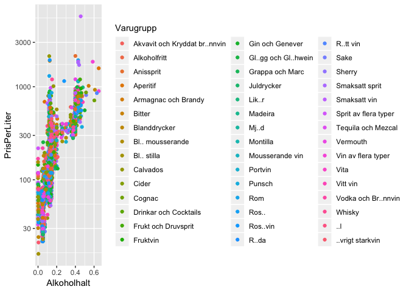
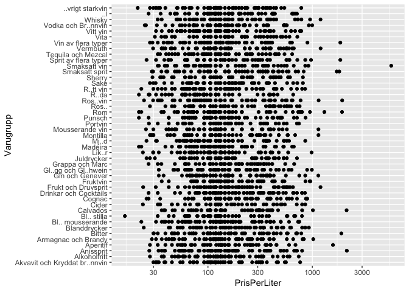
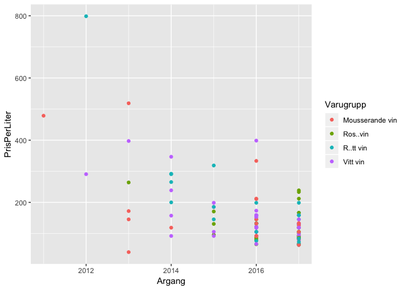

Class1
================

``` r
Sortiment_hela <- read.csv("Class_files/systembolaget2018-10-08.csv")
head(Sortiment_hela)
```

    ##        nr Artikelid Varnummer                 Namn
    ## 1     101         1         1                Renat
    ## 2 7548901   1000008     75489 Valtellina Superiore
    ## 3 7774701   1000080     77747              Canella
    ## 4 7563901   1000083     75639  Vi\303\261a Soledad
    ## 5 7521801   1000131     75218              Purcari
    ## 6 8936603   1000155     89366 Midas Golden Pilsner
    ##                                        Namn2 Prisinklmoms Volymiml
    ## 1                                                   204.0      700
    ## 2                           Sassella Riserva        339.0      750
    ## 3 Valdobbiadene Prosecco Superiore Extra Dry        147.0      750
    ## 4        T\303\252te de Cuv\303\251e Reserva        159.0      750
    ## 5                              Freedom Blend        181.0      750
    ## 6                                                    26.7      330
    ##   PrisPerLiter  Saljstart Utg..tt                 Varugrupp
    ## 1       291.43 1993-10-01       0 Vodka och Br\303\244nnvin
    ## 2       452.00 2015-09-01       0           R\303\266tt vin
    ## 3       196.00 2015-09-01       0           Mousserande vin
    ## 4       212.00 2015-09-01       0                  Vitt vin
    ## 5       241.33 2015-09-01       0           R\303\266tt vin
    ## 6        80.91 2015-09-01       0                 \303\226l
    ##                  Typ        Stil Forpackning Forslutning   Ursprung
    ## 1              Vodka                  Flaska                       
    ## 2                                     Flaska             Lombardiet
    ## 3         Vitt Torrt                  Flaska               Venetien
    ## 4 Fylligt & Smakrikt                  Flaska       Natur      Rioja
    ## 5                                     Flaska                       
    ## 6         Ljus lager Modern stil      Flaska                       
    ##   Ursprunglandnamn                       Producent              Leverantor
    ## 1          Sverige                   Pernod Ricard Pernod Ricard Sweden AB
    ## 2          Italien                          Arpepe       Vinoliv Import AB
    ## 3          Italien                     Canella SpA   Fine Brands Sweden AB
    ## 4          Spanien Bodegas Franco-Espa\303\261olas       Terrific Wines AB
    ## 5        Moldavien                         Purcari      High Coast Wine AB
    ## 6          Sverige            Imperiebryggeriet AB   Imperiebryggeriet  AB
    ##   Argang Provadargang Alkoholhalt Sortiment           SortimentText
    ## 1     NA           NA      37.50%        FS     Ordinarie sortiment
    ## 2   2011           NA      13.50%        BS \303\226vrigt sortiment
    ## 3   2014           NA      11.00%        BS \303\226vrigt sortiment
    ## 4   2006           NA      12.00%        BS \303\226vrigt sortiment
    ## 5   2015           NA      13.50%        BS \303\226vrigt sortiment
    ## 6     NA           NA       4.90%        BS \303\226vrigt sortiment
    ##   Ekologisk Etiskt Koscher RavarorBeskrivning Pant EtisktEtikett
    ## 1         0      0       0        S\303\244d.   NA          <NA>
    ## 2         0      0       0               <NA>   NA          <NA>
    ## 3         0      0       0               <NA>   NA          <NA>
    ## 4         0      0       0             Viura.   NA          <NA>
    ## 5         0      0       0               <NA>   NA          <NA>
    ## 6         0      0       0               <NA>   NA          <NA>

``` r
Sortiment_ord <- Sortiment_hela %>%
  mutate(Alkoholhalt = as.numeric(gsub("%","",Alkoholhalt))/100) %>%
  mutate(Varugrupp = ifelse(Varugrupp=="Röda", "Rött vin", ifelse(Varugrupp=="Vita", "Vitt vin", levels(Varugrupp)))) %>%
  filter(SortimentText == "Ordinarie sortiment")
head(Sortiment_ord)
```

    ##        nr Artikelid Varnummer                   Namn
    ## 1     101         1         1                  Renat
    ## 2  803901   1003765      8039                  Croft
    ## 3 7249201   1004436     72492                 Escada
    ## 4  642008   1004489      6420            Apothic Red
    ## 5 7496001   1005524     74960 Barbera del Monferrato
    ## 6 8559101   1006209     85591       MACK by Mackmyra
    ##                    Namn2 Prisinklmoms Volymiml PrisPerLiter  Saljstart
    ## 1                                 204      700       291.43 1993-10-01
    ## 2 10 Year Old Tawny Port          225      750       300.00 2015-12-01
    ## 3       Touriga Nacional           89      750       118.67 2015-10-01
    ## 4      Winemaker's Blend          289     3000        96.33 2015-10-01
    ## 5           Livio Pavese          109      750       145.33 2015-10-01
    ## 6                                 315      700       450.00 2015-10-01
    ##   Utg..tt                           Varugrupp                 Typ Stil
    ## 1       0 Akvavit och Kryddat br\303\244nnvin               Vodka     
    ## 2       0              \303\226vrigt starkvin         R\303\266tt     
    ## 3       0                 Armagnac och Brandy Fruktigt & Smakrikt     
    ## 4       0                        Blanddrycker Fruktigt & Smakrikt     
    ## 5       0                     Gin och Genever Fruktigt & Smakrikt     
    ## 6       0                             Madeira          Maltwhisky     
    ##   Forpackning     Forslutning    Ursprung Ursprunglandnamn
    ## 1      Flaska                                      Sverige
    ## 2      Flaska           Natur       Porto         Portugal
    ## 3      Flaska                      Lisboa         Portugal
    ## 4         Box Tryckknapp topp Kalifornien              USA
    ## 5      Flaska           Natur    Piemonte          Italien
    ## 6      Flaska           Plast                      Sverige
    ##                   Producent                Leverantor Argang Provadargang
    ## 1             Pernod Ricard   Pernod Ricard Sweden AB     NA           NA
    ## 2                     Croft     Spendrups Bryggeri AB     NA           NA
    ## 3                DFJ Vinhos      Prime Wine Sweden AB   2017           NA
    ## 4             Apothic Wines     Spendrups Bryggeri AB   2016           NA
    ## 5              Livio Pavese             Chris-Wine AB   2013           NA
    ## 6 Mackmyra Svensk Whisky AB Mackmyra Svensk Whisky AB     NA           NA
    ##   Alkoholhalt Sortiment       SortimentText Ekologisk Etiskt Koscher
    ## 1       0.375        FS Ordinarie sortiment         0      0       0
    ## 2       0.200       FSB Ordinarie sortiment         0      0       0
    ## 3       0.130        FS Ordinarie sortiment         0      0       0
    ## 4       0.135        FS Ordinarie sortiment         0      0       0
    ## 5       0.135        FS Ordinarie sortiment         0      0       0
    ## 6       0.400        FS Ordinarie sortiment         0      0       0
    ##                                                                     RavarorBeskrivning
    ## 1                                                                          S\303\244d.
    ## 2 Touriga nacional, touriga francesa, tinto c\303\243o, tinta roriz och tinta barroca.
    ## 3                                                                    Touriga nacional.
    ## 4                                                                                 <NA>
    ## 5                                                                             Barbera.
    ## 6                                                                                 <NA>
    ##   Pant EtisktEtikett
    ## 1   NA          <NA>
    ## 2   NA          <NA>
    ## 3   NA          <NA>
    ## 4   NA          <NA>
    ## 5   NA          <NA>
    ## 6   NA          <NA>

``` r
PrisMax <- Sortiment_hela %>%
  filter(PrisPerLiter == max(PrisPerLiter)) %>%
  select(Namn)
PrisMax
```

    ##            Namn
    ## 1 Highland Park

``` r
Expensive <- Sortiment_ord %>%
  arrange(desc(PrisPerLiter)) %>%
  slice(1:10) %>%
  select(Namn, PrisPerLiter, Varugrupp, Alkoholhalt)
kable(Expensive, format = "html")
```

<table>
<thead>
<tr>
<th style="text-align:left;">
Namn
</th>
<th style="text-align:right;">
PrisPerLiter
</th>
<th style="text-align:left;">
Varugrupp
</th>
<th style="text-align:right;">
Alkoholhalt
</th>
</tr>
</thead>
<tbody>
<tr>
<td style="text-align:left;">
Highland Park
</td>
<td style="text-align:right;">
5707.14
</td>
<td style="text-align:left;">
Smaksatt vin
</td>
<td style="text-align:right;">
0.457
</td>
</tr>
<tr>
<td style="text-align:left;">
Hennessy
</td>
<td style="text-align:right;">
2141.43
</td>
<td style="text-align:left;">
Anissprit
</td>
<td style="text-align:right;">
0.400
</td>
</tr>
<tr>
<td style="text-align:left;">
Krug
</td>
<td style="text-align:right;">
2132.00
</td>
<td style="text-align:left;">
Calvados
</td>
<td style="text-align:right;">
0.120
</td>
</tr>
<tr>
<td style="text-align:left;">
Cuv<c3><a9>e Sir Winston Churchill
</td>
<td style="text-align:right;">
1933.33
</td>
<td style="text-align:left;">
Ros<c3><a9>vin
</td>
<td style="text-align:right;">
0.125
</td>
</tr>
<tr>
<td style="text-align:left;">
The Glenlivet
</td>
<td style="text-align:right;">
1927.14
</td>
<td style="text-align:left;">
Rom
</td>
<td style="text-align:right;">
0.430
</td>
</tr>
<tr>
<td style="text-align:left;">
Dom P<c3><a9>rignon
</td>
<td style="text-align:right;">
1898.67
</td>
<td style="text-align:left;">
Bitter
</td>
<td style="text-align:right;">
0.125
</td>
</tr>
<tr>
<td style="text-align:left;">
Glengoyne
</td>
<td style="text-align:right;">
1855.71
</td>
<td style="text-align:left;">
Sprit av flera typer
</td>
<td style="text-align:right;">
0.430
</td>
</tr>
<tr>
<td style="text-align:left;">
Kavalan
</td>
<td style="text-align:right;">
1855.71
</td>
<td style="text-align:left;">
Vin av flera typer
</td>
<td style="text-align:right;">
0.586
</td>
</tr>
<tr>
<td style="text-align:left;">
Diplom<c3><a1>tico
</td>
<td style="text-align:right;">
1812.86
</td>
<td style="text-align:left;">
Smaksatt sprit
</td>
<td style="text-align:right;">
0.430
</td>
</tr>
<tr>
<td style="text-align:left;">
Jura
</td>
<td style="text-align:right;">
1712.86
</td>
<td style="text-align:left;">
Smaksatt sprit
</td>
<td style="text-align:right;">
0.440
</td>
</tr>
</tbody>
</table>
``` r
ggplot(Sortiment_ord, aes(x = Alkoholhalt, y = PrisPerLiter, color = Varugrupp)) + 
  geom_point() + 
  scale_y_log10()
```



``` r
ggplot(Sortiment_ord, aes(x = Varugrupp, y = PrisPerLiter)) + 
  geom_point() + 
  scale_y_log10() + 
  coord_flip()
```



``` r
Sortiment_ord %>%
  filter(Varugrupp %in% c("Vitt vin", "Rött vin", "Rosévin", "Mousserande vin"), Argang %in% c(2010:2017)) %>%
  ggplot(aes(x = Argang, y = PrisPerLiter, color = Varugrupp)) + geom_point()
```


