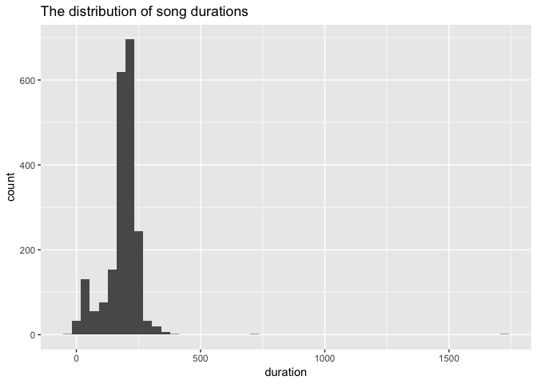
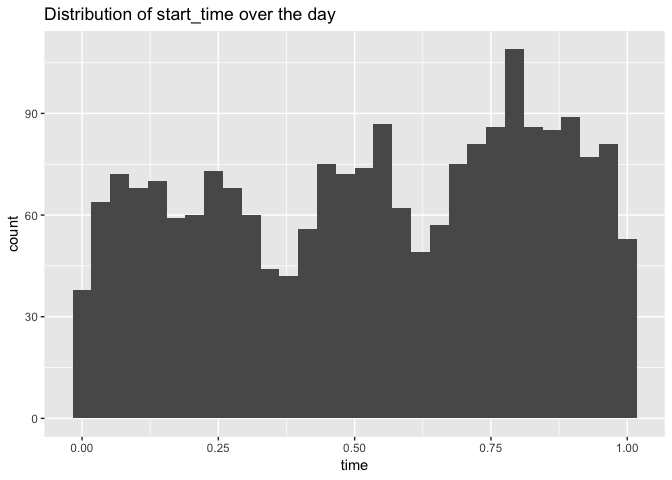
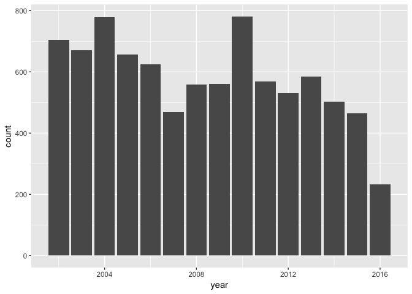
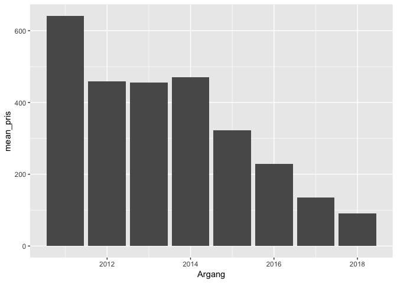

Class 3: Tidyverse: group\_by and summarise, more ggplot2
================

Nga Nguyen

``` r
library(tidyverse)
```

    ## ── Attaching packages ──────────────────────────────────────────────────────────────────────── tidyverse 1.2.1 ──

    ## ✔ ggplot2 3.0.0     ✔ purrr   0.2.5
    ## ✔ tibble  1.4.2     ✔ dplyr   0.7.6
    ## ✔ tidyr   0.8.1     ✔ stringr 1.3.1
    ## ✔ readr   1.1.1     ✔ forcats 0.3.0

    ## ── Conflicts ─────────────────────────────────────────────────────────────────────────── tidyverse_conflicts() ──
    ## ✖ dplyr::filter() masks stats::filter()
    ## ✖ dplyr::lag()    masks stats::lag()

``` r
#library(tidyr)
library(ggplot2)
library(chron)
library(knitr)
library(stringr)
```

SR songs
========

The script Class\_files/SR\_music.R contains a simple function get\_SR\_music for grabbing music played on Swedish Radio channels from their open API. Load it by

``` r
source("Class_files/SR_music.R")
```

    ## 
    ## Attaching package: 'jsonlite'

    ## The following object is masked from 'package:purrr':
    ## 
    ##     flatten

and grab e.g. the songs on P3 (channel 164) at the turn of last year by

``` r
music_day <- get_SR_music(channel = 164, date = "2017-12-31") %>%
  select(title, artist, start_time, stop_time)
```

If you want multiple dates, the map-functions from the purrr-package (included in the tidyverse) are convenient (more about these later on in the course). Grabbing music played from e.g. 2018-01-01 to 2018-01-07 into music is done by

``` r
days <- seq(as.Date("2018-01-01"), as.Date("2018-01-07"), "days")

music_days <- map_df(days, get_SR_music, channel = 164) %>%
  select(title, artist, start_time, stop_time)
```

Note: Data is not entirely clean and the same artist/song may be coded in multiple ways (e.g. Cherrie & Z.E., Cherrie, Z.e and Cherrie, Z.E). You may ignore this for now.

Pick a date, or a sequence of dates, and list the 5 most played songs.

``` r
by_title_day <- music_day %>%
  group_by(title) %>%
  summarise(numberViews = n()) %>%
  select(title, numberViews) %>%
  arrange(desc(numberViews))

mostViews <- by_title_day %>% 
  select(title) %>%
  head(n = 5)
mostViews
```

    ## # A tibble: 5 x 1
    ##   title              
    ##   <chr>              
    ## 1 Beautiful          
    ## 2 Pari               
    ## 3 Too Good To Be True
    ## 4 All Falls Down     
    ## 5 Despacito (Remix)

What artist has the most number of different songs played over some sequence of days?

``` r
by_artist <- music_days %>%
  group_by(artist) %>%
  summarise(numberSongs = n()) %>%
  select(artist, numberSongs) %>%
  arrange(desc(numberSongs))
mostSongs <- by_artist %>% 
  slice(1) %>% 
  select(artist)
mostSongs
```

    ## # A tibble: 1 x 1
    ##   artist      
    ##   <chr>       
    ## 1 Taylor Swift

Visualise the distribution of song durations.

``` r
music_days <- music_days %>%
  mutate(duration = as.numeric(stop_time-start_time))

ggplot(music_days, aes(x = duration)) + geom_histogram(bins = 50) + ggtitle("The distribution of song durations")
```



Pick a sequence of dates and visualise how the songs start\_times are distributed over the day. Repeat for another channel, e.g. P2 (channel 163). You can grab components of a date-time (POSIXct) object with format as in

``` r
as.POSIXct("2018-01-01 23:57:04 CET") %>% format("%H:%M")
```

    ## [1] "23:57"

for extracting the hour and minute, see ?format.POSIXct for more examples. Note that the above code results in a value of character-type, you may want to further convert to numeric format (e.g. minutes or hours after midnight) before plotting.

Visualise the number of hours spent playing music each day over a sequence of dates.

``` r
music_days <- music_days %>%
  mutate(time = as.numeric(chron::times(as.POSIXct(start_time) %>% format("%H:%M:%S"))))

by_date <- music_days %>%
  select(time)

ggplot(by_date, aes(x = time)) + geom_histogram() + 
  ggtitle("Distribution of start_time over the day")
```

    ## `stat_bin()` using `bins = 30`. Pick better value with `binwidth`.



``` r
music_days <- music_days %>%
  mutate(date = as.POSIXct(start_time) %>% format("%Y-%m-%d")) %>%
  select(date, duration)
music_days_hour <- music_days %>%
  group_by(date) %>%
  mutate(nHour = sum(as.numeric(duration))/3600)

ggplot(music_days_hour, aes(x = date, y = nHour)) + geom_point() + coord_flip()
```


Insurance claims from kammarkollegiet
=====================================

Kammarkollegiet is a public agency that among other things issue insurances. The file Class\_files/claims.csv contains data on claims from one of their personal insurances. Each claim has an unique Claim id, a Claim date, a Closing date and a number of Payments disbursed at Payment dates. If the claim is not closed (there may be more payments coming) Closing date is given value NA. Null claims, i.e. claims that has been closed without payment, are not included.

Read the data by

``` r
claim_data <- read_csv("Class_files/claims.csv")
```

    ## Parsed with column specification:
    ## cols(
    ##   `Claim id` = col_character(),
    ##   `Claim date` = col_date(format = ""),
    ##   `Reported date` = col_date(format = ""),
    ##   `Closing date` = col_date(format = ""),
    ##   `Payment date` = col_date(format = ""),
    ##   Payment = col_double()
    ## )

``` r
glimpse(claim_data)
```

    ## Observations: 22,959
    ## Variables: 6
    ## $ `Claim id`      <chr> "000002-16", "000002-16", "000002-16", "000002...
    ## $ `Claim date`    <date> 2013-12-03, 2013-12-03, 2013-12-03, 2013-12-0...
    ## $ `Reported date` <date> 2016-01-15, 2016-01-15, 2016-01-15, 2016-01-1...
    ## $ `Closing date`  <date> 2016-11-02, 2016-11-02, 2016-11-02, 2016-11-0...
    ## $ `Payment date`  <date> 2016-01-21, 2016-06-20, 2016-06-27, 2016-11-0...
    ## $ Payment         <dbl> 130, 4250, 41400, 2781, 2400, 3700, 3690, 391,...

Plot the number of claims per year (each Claim id should only be counted once!).

``` r
colnames(claim_data) <- str_replace(colnames(claim_data), " ", "_")
claim_by_year <- claim_data %>%
  mutate(year = as.numeric(as.POSIXct(Claim_date) %>% format("%Y"))) %>%
  select(Claim_id, year) %>%
  distinct(Claim_id, .keep_all = TRUE)

ggplot(claim_by_year, aes(x = year)) + geom_bar()
```



Actuaries are very fond of loss triangles. This is a table where the value on row i, column j is the sum of all payments on claims with Claim date in year i that are disbursed until the j:th calendar year after the year of the claim/accident. The table will be a triangle since future payments are not available.

For claims made since 2010, compute the loss triange and print it with knitr::kable. Try to do it in a single sequence of pipes. If future payments are coded as NA, using options(knitr.kable.NA = '') will result in a nicer looking table.

``` r
mytab <- claim_data %>% 
  mutate(year = as.numeric(as.POSIXct(Claim_date) %>% format("%Y"))) %>%
  filter(year >= 2010) %>%
  mutate(closing_year = as.numeric(as.POSIXct(Closing_date) %>% format("%Y"))) %>%
  mutate(duration = (closing_year - year)) %>%
  group_by(duration, year) %>%
  summarize(loss = sum(Payment)) %>%
  filter(!is.na(duration)) %>%
  spread(duration, loss)

kable(mytab)
```

|  year|         0|        1|        2|        3|        4|         5|       6|
|-----:|---------:|--------:|--------:|--------:|--------:|---------:|-------:|
|  2010|  510018.0|  3088112|  4647158|  1822604|  2137421|  758912.5|  821161|
|  2011|  551435.2|  2058350|  2400339|  1667244|  1247299|  814415.0|   11900|
|  2012|  234650.0|  1699957|  4118429|  2362584|  1290159|        NA|      NA|
|  2013|  440172.0|  2090456|  2527246|  2243057|   548920|        NA|      NA|
|  2014|  294981.0|  2150932|  4212814|   299683|       NA|        NA|      NA|
|  2015|  407139.0|  3313439|   468328|       NA|       NA|        NA|      NA|
|  2016|  437061.0|    31259|       NA|       NA|       NA|        NA|      NA|

``` r
options(knitr.kable.NA = '')
```

Election 2018
=============

All political parties participating in the 2018 Swedish elections can be downloaded from Valmyndigheten by

``` r
parties_2018 <- read_csv2("https://data.val.se/val/val2018/valsedlar/partier/deltagande_partier.skv", locale = locale("sv", encoding = "ISO-8859-1"))
```

    ## Using ',' as decimal and '.' as grouping mark. Use read_delim() for more control.

    ## Parsed with column specification:
    ## cols(
    ##   VALTYP = col_character(),
    ##   VALOMRÅDESKOD = col_character(),
    ##   VALOMRÅDESNAMN = col_character(),
    ##   VALKRETSKOD = col_integer(),
    ##   VALKRETSNAMN = col_character(),
    ##   LÄNSKOD = col_character(),
    ##   LÄNSNAMN = col_character(),
    ##   PARTIBETECKNING = col_character(),
    ##   PARTIFÖRKORTNING = col_character(),
    ##   PARTIKOD = col_integer(),
    ##   ANMÄLNINGSDATUM = col_date(format = ""),
    ##   REGISTRERINGSDATUM = col_date(format = ""),
    ##   DIARIENUMMER = col_character(),
    ##   REGISTRERADPARTIBETECKNING = col_character(),
    ##   ANMÄLDAKANDIDATER = col_character(),
    ##   SYMBOL = col_character(),
    ##   DELTAGANDEGRUND = col_character()
    ## )

``` r
glimpse(parties_2018)
```

    ## Observations: 34,917
    ## Variables: 17
    ## $ VALTYP                     <chr> "R", "R", "R", "R", "R", "R", "R", ...
    ## $ VALOMRÅDESKOD              <chr> "00", "00", "00", "00", "00", "00",...
    ## $ VALOMRÅDESNAMN             <chr> "Riksdagen", "Riksdagen", "Riksdage...
    ## $ VALKRETSKOD                <int> 1, 1, 1, 1, 1, 1, 1, 1, 1, 1, 1, 1,...
    ## $ VALKRETSNAMN               <chr> "Stockholms kommun", "Stockholms ko...
    ## $ LÄNSKOD                    <chr> "01", "01", "01", "01", "01", "01",...
    ## $ LÄNSNAMN                   <chr> "Stockholms län", "Stockholms län",...
    ## $ PARTIBETECKNING            <chr> "20% skattepartiet", "Allians för S...
    ## $ PARTIFÖRKORTNING           <chr> NA, NA, "AfS", "S", "S", NA, NA, NA...
    ## $ PARTIKOD                   <int> 1365, 1423, 1325, 2, 2, 1420, 1372,...
    ## $ ANMÄLNINGSDATUM            <date> 2018-03-29, 2018-08-10, NA, NA, NA...
    ## $ REGISTRERINGSDATUM         <date> 2018-03-29, 2018-08-13, NA, NA, NA...
    ## $ DIARIENUMMER               <chr> "200-142033-18/98234", "200-317788-...
    ## $ REGISTRERADPARTIBETECKNING <chr> "N", "N", "J", "J", "J", "N", "N", ...
    ## $ ANMÄLDAKANDIDATER          <chr> "N", "N", "J", "J", "J", "N", "N", ...
    ## $ SYMBOL                     <chr> NA, NA, "AfS_val2018.png", "S_val20...
    ## $ DELTAGANDEGRUND            <chr> "A", "A", "K", "K", "R", "A", "A", ...

How many unique parties participated in each of the three elections (VALTYP equals R for Riksdagen, L for Landsting and K for Kommun)? Note that the same party may appear multiple times (based on e.g. multiple reasons of inclusion in DELTAGANDEGRUND)

``` r
parties_2018 %>%
  group_by(VALTYP) %>%
  summarize(n = n_distinct(PARTIKOD))
```

    ## # A tibble: 3 x 2
    ##   VALTYP     n
    ##   <chr>  <int>
    ## 1 K        299
    ## 2 L        102
    ## 3 R         79

How many local parties (parties only participating within a single VALKRETSKOD) participated in the Kommunalval (VALTYP equals K)?

``` r
parties_2018 %>%
  filter(VALTYP == "K") %>%
  group_by(VALKRETSKOD) %>%
  summarize(n = n_distinct(PARTIKOD))
```

    ## # A tibble: 7 x 2
    ##   VALKRETSKOD     n
    ##         <int> <int>
    ## 1           0   281
    ## 2           1   102
    ## 3           2   102
    ## 4           3    87
    ## 5           4    81
    ## 6           5    81
    ## 7           6    81

Systembolaget’s assortment
==========================

As in last class load Systembolaget’s assortment and select the regular product range.

``` r
Sortiment_hela <- read_csv("Class_files/systembolaget2018-10-08.csv")
```

    ## Parsed with column specification:
    ## cols(
    ##   .default = col_character(),
    ##   nr = col_integer(),
    ##   Artikelid = col_integer(),
    ##   Varnummer = col_integer(),
    ##   Prisinklmoms = col_double(),
    ##   Volymiml = col_double(),
    ##   PrisPerLiter = col_double(),
    ##   Saljstart = col_date(format = ""),
    ##   Utgått = col_integer(),
    ##   Argang = col_integer(),
    ##   Ekologisk = col_integer(),
    ##   Etiskt = col_integer(),
    ##   Koscher = col_integer(),
    ##   Pant = col_double()
    ## )

    ## See spec(...) for full column specifications.

``` r
glimpse(Sortiment_hela)
```

    ## Observations: 17,591
    ## Variables: 30
    ## $ nr                 <int> 101, 7548901, 7774701, 7563901, 7521801, 89...
    ## $ Artikelid          <int> 1, 1000008, 1000080, 1000083, 1000131, 1000...
    ## $ Varnummer          <int> 1, 75489, 77747, 75639, 75218, 89366, 87805...
    ## $ Namn               <chr> "Renat", "Valtellina Superiore", "Canella",...
    ## $ Namn2              <chr> NA, "Sassella Riserva", "Valdobbiadene Pros...
    ## $ Prisinklmoms       <dbl> 204.0, 339.0, 147.0, 159.0, 181.0, 26.7, 37...
    ## $ Volymiml           <dbl> 700, 750, 750, 750, 750, 330, 700, 1000, 70...
    ## $ PrisPerLiter       <dbl> 291.43, 452.00, 196.00, 212.00, 241.33, 80....
    ## $ Saljstart          <date> 1993-10-01, 2015-09-01, 2015-09-01, 2015-0...
    ## $ Utgått             <int> 0, 0, 0, 0, 0, 0, 0, 0, 0, 0, 0, 0, 0, 0, 0...
    ## $ Varugrupp          <chr> "Vodka och Brännvin", "Rött vin", "Moussera...
    ## $ Typ                <chr> "Vodka", NA, "Vitt Torrt", "Fylligt & Smakr...
    ## $ Stil               <chr> NA, NA, NA, NA, NA, "Modern stil", NA, NA, ...
    ## $ Forpackning        <chr> "Flaska", "Flaska", "Flaska", "Flaska", "Fl...
    ## $ Forslutning        <chr> NA, NA, NA, "Natur", NA, NA, NA, NA, NA, "B...
    ## $ Ursprung           <chr> NA, "Lombardiet", "Venetien", "Rioja", NA, ...
    ## $ Ursprunglandnamn   <chr> "Sverige", "Italien", "Italien", "Spanien",...
    ## $ Producent          <chr> "Pernod Ricard", "Arpepe", "Canella SpA", "...
    ## $ Leverantor         <chr> "Pernod Ricard Sweden AB", "Vinoliv Import ...
    ## $ Argang             <int> NA, 2011, 2014, 2006, 2015, NA, NA, NA, NA,...
    ## $ Provadargang       <chr> NA, NA, NA, NA, NA, NA, NA, NA, NA, NA, NA,...
    ## $ Alkoholhalt        <chr> "37.50%", "13.50%", "11.00%", "12.00%", "13...
    ## $ Sortiment          <chr> "FS", "BS", "BS", "BS", "BS", "BS", "BS", "...
    ## $ SortimentText      <chr> "Ordinarie sortiment", "Övrigt sortiment", ...
    ## $ Ekologisk          <int> 0, 0, 0, 0, 0, 0, 0, 0, 0, 0, 0, 0, 0, 0, 0...
    ## $ Etiskt             <int> 0, 0, 0, 0, 0, 0, 0, 0, 0, 0, 0, 0, 0, 0, 0...
    ## $ Koscher            <int> 0, 0, 0, 0, 0, 0, 0, 0, 0, 0, 0, 0, 0, 0, 0...
    ## $ RavarorBeskrivning <chr> "Säd.", NA, NA, "Viura.", NA, NA, NA, NA, N...
    ## $ Pant               <dbl> NA, NA, NA, NA, NA, NA, NA, NA, NA, NA, NA,...
    ## $ EtisktEtikett      <chr> NA, NA, NA, NA, NA, NA, NA, NA, NA, NA, NA,...

How many beverages are there in each group of products (Varugrupp)? Use filter and is.na to filter out beverages where Varugrupp is not available.

``` r
Sortiment_hela %>%
  group_by(Varugrupp) %>%
  summarize(number = n()) %>%
  filter(!is.na(Varugrupp))
```

    ## # A tibble: 45 x 2
    ##    Varugrupp                    number
    ##    <chr>                         <int>
    ##  1 Akvavit och Kryddat brännvin    216
    ##  2 Alkoholfritt                    101
    ##  3 Anissprit                        28
    ##  4 Aperitif                         27
    ##  5 Armagnac och Brandy              87
    ##  6 Bitter                           52
    ##  7 Blå mousserande                   4
    ##  8 Blå stilla                        3
    ##  9 Blanddrycker                     55
    ## 10 Calvados                         72
    ## # ... with 35 more rows

Select red wines of vintage 2011-2018. Compute the mean PrisPerLiter for each vintage and visualise using ggplot.

``` r
Sortiment_hela %>%
  filter(Varugrupp == "Rött vin", Argang %in% c(2011:2018)) %>%
  group_by(Argang) %>%
  summarize(mean_pris = mean(PrisPerLiter, na.rm = TRUE)) %>%
  ggplot(aes(x = Argang, y = mean_pris)) + geom_col()
```



List the cheapest beverage (by PrisPerLiter) in each Varugrupp.

``` r
Sortiment_hela %>%
  group_by(Varugrupp) %>%
  summarize(min_bev = min(PrisPerLiter, na.rm = TRUE))
```

    ## # A tibble: 45 x 2
    ##    Varugrupp                    min_bev
    ##    <chr>                          <dbl>
    ##  1 Akvavit och Kryddat brännvin   313. 
    ##  2 Alkoholfritt                    16  
    ##  3 Anissprit                      389. 
    ##  4 Aperitif                        78.7
    ##  5 Armagnac och Brandy            299. 
    ##  6 Bitter                         290  
    ##  7 Blå mousserande                 78.7
    ##  8 Blå stilla                     119. 
    ##  9 Blanddrycker                    30  
    ## 10 Calvados                       418  
    ## # ... with 35 more rows
