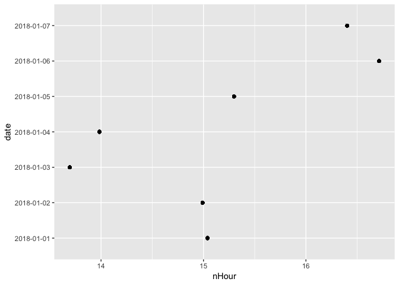

Class2
================

``` r
library(tidyverse)
```

    ## -- Attaching packages --------------------------------------- tidyverse 1.2.1 --

    ## <U+221A> ggplot2 3.0.0     <U+221A> purrr   0.2.5
    ## <U+221A> tibble  1.4.2     <U+221A> dplyr   0.7.6
    ## <U+221A> tidyr   0.8.1     <U+221A> stringr 1.3.1
    ## <U+221A> readr   1.1.1     <U+221A> forcats 0.3.0

    ## -- Conflicts ------------------------------------------ tidyverse_conflicts() --
    ## x dplyr::filter() masks stats::filter()
    ## x dplyr::lag()    masks stats::lag()

``` r
library(ggplot2)
library(chron)
```

``` r
source("Class_files/SR_music.R")
```

    ## 
    ## Attaching package: 'jsonlite'

    ## The following object is masked from 'package:purrr':
    ## 
    ##     flatten

``` r
music_day <- get_SR_music(channel = 164, date = "2017-12-31") %>%
  select(title, artist, start_time, stop_time)

days <- seq(as.Date("2018-01-01"), as.Date("2018-01-07"), "days")

music_days <- map_df(days, get_SR_music, channel = 164) %>%
  select(title, artist, start_time, stop_time)

by_title_day <- music_day %>%
  group_by(title) %>%
  summarise(numberViews = n()) %>%
  select(title, numberViews) %>%
  arrange(desc(numberViews))

mostViews <- by_title_day %>% slice(1:5) %>% select(title)
mostViews
```

    ## # A tibble: 5 x 1
    ##   title              
    ##   <chr>              
    ## 1 Beautiful          
    ## 2 Pari               
    ## 3 Too Good To Be True
    ## 4 All Falls Down     
    ## 5 Despacito (Remix)

``` r
by_title_days <- music_days %>%
  group_by(title) %>%
  summarise(numberViews = n()) %>%
  select(title, numberViews) %>%
  arrange(desc(numberViews))

mostViews <- by_title_days %>% slice(1:5) %>% select(title)
mostViews
```

    ## # A tibble: 5 x 1
    ##   title         
    ##   <chr>         
    ## 1 Beautiful     
    ## 2 Dreamer       
    ## 3 Getaway Car   
    ## 4 Only Human    
    ## 5 All Falls Down

``` r
by_artist <- music_days %>%
  group_by(artist) %>%
  summarise(numberSongs = n()) %>%
  select(artist, numberSongs) %>%
  arrange(desc(numberSongs))
mostSongs <- by_artist %>% slice(1) %>% select(artist)
mostSongs
```

    ## # A tibble: 1 x 1
    ##   artist      
    ##   <chr>       
    ## 1 Taylor Swift

``` r
music_days <- music_days %>%
  mutate(duration = stop_time-start_time)

ggplot(music_days, aes(x = duration)) + geom_histogram(bins = 100) + ggtitle("The distribution of song durations")
```

    ## Don't know how to automatically pick scale for object of type difftime. Defaulting to continuous.


``` r
music_days <- music_days %>%
  mutate(time = as.numeric(chron::times(as.POSIXct(start_time) %>% format("%H:%M:%S"))))

by_date <- music_days %>%
  select(time)

ggplot(by_date, aes(x = time)) + geom_histogram() + 
  ggtitle("Distribution of start_time over the day")
```

    ## `stat_bin()` using `bins = 30`. Pick better value with `binwidth`.


``` r
music_days <- music_days %>%
  mutate(date = as.POSIXct(start_time) %>% format("%Y-%m-%d")) %>%
  select(date, duration)
music_days_hour <- music_days %>%
  group_by(date) %>%
  mutate(nHour = sum(as.numeric(duration))/3600)

ggplot(music_days_hour, aes(x = date, y = nHour)) + geom_point() + coord_flip()
```


