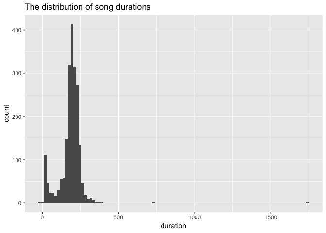

Class2
================

``` r
library(tidyverse)
```

    ## -- Attaching packages ------------------------------------------------- tidyverse 1.2.1 --

    ## <U+221A> ggplot2 3.0.0     <U+221A> purrr   0.2.5
    ## <U+221A> tibble  1.4.2     <U+221A> dplyr   0.7.6
    ## <U+221A> tidyr   0.8.1     <U+221A> stringr 1.3.1
    ## <U+221A> readr   1.1.1     <U+221A> forcats 0.3.0

    ## -- Conflicts ---------------------------------------------------- tidyverse_conflicts() --
    ## x dplyr::filter() masks stats::filter()
    ## x dplyr::lag()    masks stats::lag()

``` r
library(ggplot2)
library(chron)
```

``` r
source("Class_files/SR_music.R")
```

    ## 
    ## Attaching package: 'jsonlite'

    ## The following object is masked from 'package:purrr':
    ## 
    ##     flatten

``` r
music_day <- get_SR_music(channel = 164, date = "2017-12-31") %>%
  select(title, artist, start_time, stop_time)

days <- seq(as.Date("2018-01-01"), as.Date("2018-01-07"), "days")

music_days <- map_df(days, get_SR_music, channel = 164) %>%
  select(title, artist, start_time, stop_time)

by_title_day <- music_day %>%
  group_by(title) %>%
  summarise(numberViews = n()) %>%
  select(title, numberViews) %>%
  arrange(desc(numberViews))

mostViews <- by_title_day %>% slice(1:5) %>% select(title)
mostViews
```

    ## # A tibble: 5 x 1
    ##   title              
    ##   <chr>              
    ## 1 Beautiful          
    ## 2 Pari               
    ## 3 Too Good To Be True
    ## 4 All Falls Down     
    ## 5 Despacito (Remix)

``` r
by_title_days <- music_days %>%
  group_by(title) %>%
  summarise(numberViews = n()) %>%
  select(title, numberViews) %>%
  arrange(desc(numberViews))

mostViews <- by_title_days %>% slice(1:5) %>% select(title)
mostViews
```

    ## # A tibble: 5 x 1
    ##   title         
    ##   <chr>         
    ## 1 Beautiful     
    ## 2 Dreamer       
    ## 3 Getaway Car   
    ## 4 Only Human    
    ## 5 All Falls Down

``` r
by_artist <- music_days %>%
  group_by(artist) %>%
  summarise(numberSongs = n()) %>%
  select(artist, numberSongs) %>%
  arrange(desc(numberSongs))
mostSongs <- by_artist %>% slice(1) %>% select(artist)
mostSongs
```

    ## # A tibble: 1 x 1
    ##   artist      
    ##   <chr>       
    ## 1 Taylor Swift

``` r
music_days <- music_days %>%
  mutate(duration = stop_time-start_time)

ggplot(music_days, aes(x = duration)) + geom_histogram(bins = 100) + ggtitle("The distribution of song durations")
```

    ## Don't know how to automatically pick scale for object of type difftime. Defaulting to continuous.



``` r
music_days <- music_days %>%
  mutate(time = as.numeric(chron::times(as.POSIXct(start_time) %>% format("%H:%M:%S"))))

by_date <- music_days %>%
  select(time)

ggplot(by_date, aes(x = time)) + geom_histogram() + 
  ggtitle("Distribution of start_time over the day")
```

    ## `stat_bin()` using `bins = 30`. Pick better value with `binwidth`.


``` r
music_days <- music_days %>%
  mutate(date = as.POSIXct(start_time) %>% format("%Y-%m-%d")) %>%
  select(date, duration)
music_days_hour <- music_days %>%
  group_by(date) %>%
  mutate(nHour = sum(as.numeric(duration))/3600)

ggplot(music_days_hour, aes(x = date, y = nHour)) + geom_point() + coord_flip()
```


``` r
claim_data <- read.csv("Class_files/claims.csv")

claim_by_year <- claim_data %>%
  mutate(year = as.numeric(as.POSIXct(Claim.date) %>% format("%Y")))

ggplot(claim_by_year, aes(x = year)) + geom_bar()
```


``` r
claim_by_year %>% 
  filter(year>=2010) %>%
  mutate(closing.year = as.numeric(as.POSIXct(Closing.date) %>% format("%Y"))) %>%
  mutate(duration = (closing.year - year)) %>%
  group_by(duration, year) %>%
  summarize(loss = sum(Payment)) %>%
  filter(!is.na(duration)) %>%
  xtabs(formula=loss~year+duration)
```

    ##       duration
    ## year           0         1         2         3         4         5
    ##   2010  510018.0 3088112.5 4647157.5 1822603.5 2137421.0  758912.5
    ##   2011  551435.2 2058350.0 2400339.0 1667243.5 1247299.0  814415.0
    ##   2012  234650.0 1699957.0 4118429.0 2362584.0 1290159.0       0.0
    ##   2013  440172.0 2090456.0 2527246.0 2243057.0  548920.0       0.0
    ##   2014  294981.0 2150932.0 4212814.0  299683.0       0.0       0.0
    ##   2015  407139.0 3313439.0  468328.0       0.0       0.0       0.0
    ##   2016  437061.0   31259.0       0.0       0.0       0.0       0.0
    ##       duration
    ## year           6
    ##   2010  821161.0
    ##   2011   11900.0
    ##   2012       0.0
    ##   2013       0.0
    ##   2014       0.0
    ##   2015       0.0
    ##   2016       0.0

``` r
parties_2018 <- read_csv2("https://data.val.se/val/val2018/valsedlar/partier/deltagande_partier.skv", locale = locale("sv", encoding = "ISO-8859-1"))
```

    ## Using ',' as decimal and '.' as grouping mark. Use read_delim() for more control.

    ## Parsed with column specification:
    ## cols(
    ##   VALTYP = col_character(),
    ##   `VALOMR<U+00C5>DESKOD` = col_character(),
    ##   `VALOMR<U+00C5>DESNAMN` = col_character(),
    ##   VALKRETSKOD = col_integer(),
    ##   VALKRETSNAMN = col_character(),
    ##   `L<U+00C4>NSKOD` = col_character(),
    ##   `L<U+00C4>NSNAMN` = col_character(),
    ##   PARTIBETECKNING = col_character(),
    ##   `PARTIF<U+00D6>RKORTNING` = col_character(),
    ##   PARTIKOD = col_integer(),
    ##   `ANM<U+00C4>LNINGSDATUM` = col_date(format = ""),
    ##   REGISTRERINGSDATUM = col_date(format = ""),
    ##   DIARIENUMMER = col_character(),
    ##   REGISTRERADPARTIBETECKNING = col_character(),
    ##   `ANM<U+00C4>LDAKANDIDATER` = col_character(),
    ##   SYMBOL = col_character(),
    ##   DELTAGANDEGRUND = col_character()
    ## )

``` r
parties_2018 %>%
  group_by(VALTYP) %>%
  summarize(n = n_distinct(PARTIKOD))
```

    ## # A tibble: 3 x 2
    ##   VALTYP     n
    ##   <chr>  <int>
    ## 1 K        299
    ## 2 L        102
    ## 3 R         79

``` r
parties_2018 %>%
  filter(VALTYP == "K") %>%
  group_by(VALKRETSKOD) %>%
  summarize(n = n_distinct(PARTIKOD))
```

    ## Warning: Mangling the following names: VALOMR<U+00C5>DESKOD ->
    ## VALOMR<U+00C5>DESKOD, VALOMR<U+00C5>DESNAMN -> VALOMR<U+00C5>DESNAMN,
    ## L<U+00C4>NSKOD -> L<U+00C4>NSKOD, L<U+00C4>NSNAMN -> L<U+00C4>NSNAMN,
    ## PARTIF<U+00D6>RKORTNING -> PARTIF<U+00D6>RKORTNING, ANM<U+00C4>LNINGSDATUM
    ## -> ANM<U+00C4>LNINGSDATUM, ANM<U+00C4>LDAKANDIDATER ->
    ## ANM<U+00C4>LDAKANDIDATER. Use enc2native() to avoid the warning.

    ## # A tibble: 7 x 2
    ##   VALKRETSKOD     n
    ##         <int> <int>
    ## 1           0   281
    ## 2           1   102
    ## 3           2   102
    ## 4           3    87
    ## 5           4    81
    ## 6           5    81
    ## 7           6    81
