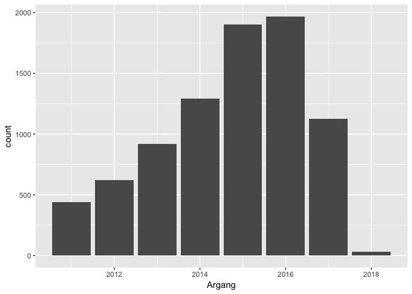
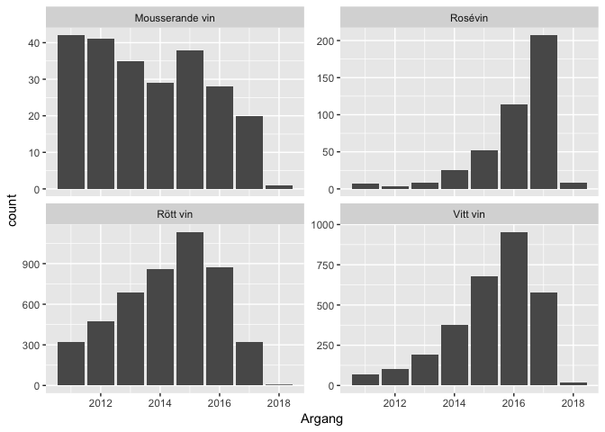
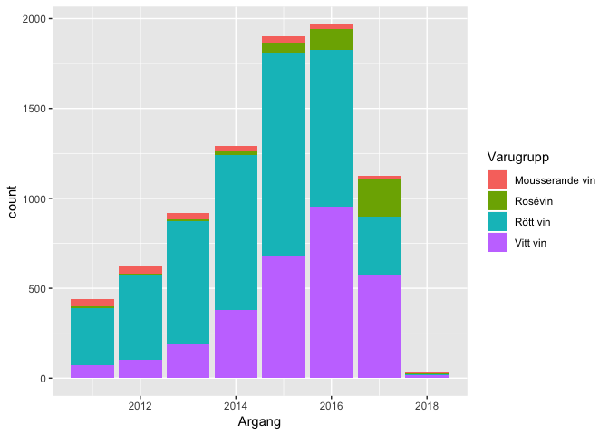
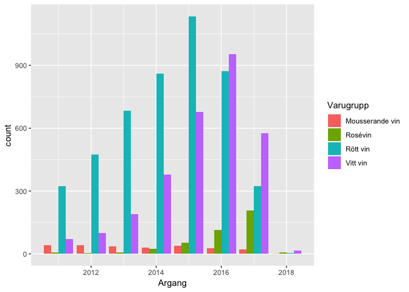
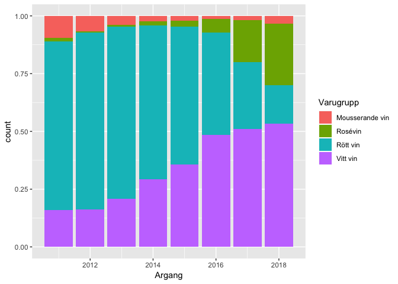
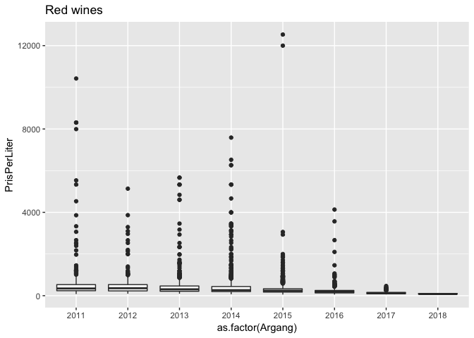
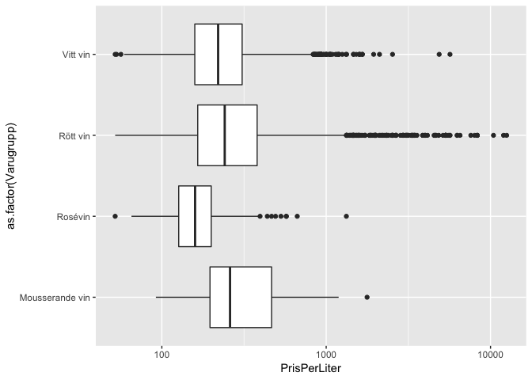
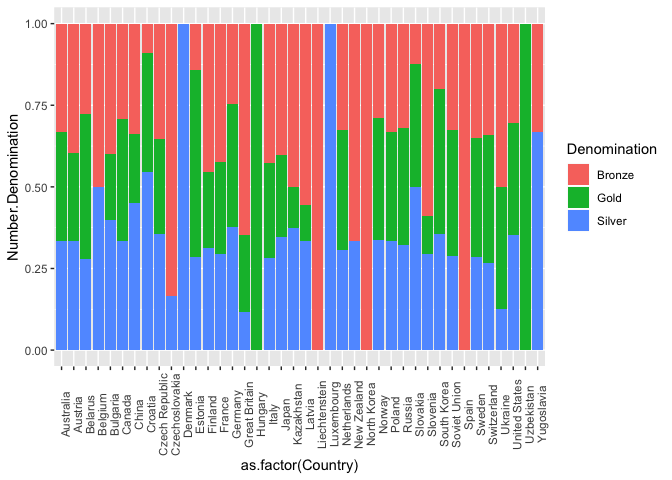

Class 4: Exploratory data analysis
================

Nga Nguyen

``` r
library(ggplot2)
library(tidyverse)
```

    ## ── Attaching packages ──────────────────────────────────────────────────────────────────────── tidyverse 1.2.1 ──

    ## ✔ tibble  1.4.2     ✔ purrr   0.2.5
    ## ✔ tidyr   0.8.1     ✔ dplyr   0.7.6
    ## ✔ readr   1.1.1     ✔ stringr 1.3.1
    ## ✔ tibble  1.4.2     ✔ forcats 0.3.0

    ## ── Conflicts ─────────────────────────────────────────────────────────────────────────── tidyverse_conflicts() ──
    ## ✖ dplyr::filter() masks stats::filter()
    ## ✖ dplyr::lag()    masks stats::lag()

``` r
library(knitr)
library(readr)
```

Systembolaget’s assortment
--------------------------

Use filter to extract the groups of products c("Vitt vin", "Rött vin", "Rosévin", "Mousserande vin") of vintage 2011-2018.

``` r
Sortiment_hela <- read_csv("Class_files/systembolaget2018-10-08.csv")
```

    ## Parsed with column specification:
    ## cols(
    ##   .default = col_character(),
    ##   nr = col_integer(),
    ##   Artikelid = col_integer(),
    ##   Varnummer = col_integer(),
    ##   Prisinklmoms = col_double(),
    ##   Volymiml = col_double(),
    ##   PrisPerLiter = col_double(),
    ##   Saljstart = col_date(format = ""),
    ##   Utgått = col_integer(),
    ##   Argang = col_integer(),
    ##   Ekologisk = col_integer(),
    ##   Etiskt = col_integer(),
    ##   Koscher = col_integer(),
    ##   Pant = col_double()
    ## )

    ## See spec(...) for full column specifications.

``` r
#str(Sortiment_hela)

mydata <- Sortiment_hela %>%
  filter(Varugrupp %in% c("Vitt vin", "Rött vin", "Rosévin", "Mousserande vin"), Argang %in% c(2011:2018))
```

ggplot with aes(x = Argang), geom\_bar()

``` r
ggplot(mydata, aes(x = Argang)) + geom_bar()
```



ggplot with aes(x = Argang), geom\_bar() and facet\_wrap(~ Varugrupp) (try adding scale = "free\_y" to facet\_wrap)

``` r
ggplot(mydata, aes(x = Argang)) + geom_bar() + facet_wrap(~ Varugrupp, scale = "free_y")
```



ggplot with aes(x = Argang, fill = Varugrupp) and geom\_bar()

``` r
ggplot(mydata, aes(x = Argang, fill = Varugrupp)) + geom_bar()
```



geom\_bar(position = "dodge")

``` r
ggplot(mydata, aes(x = Argang, fill = Varugrupp)) + geom_bar(position = "dodge")
```



geom\_bar(position = "fill")

``` r
ggplot(mydata, aes(x = Argang, fill = Varugrupp)) + geom_bar(position = "fill")
```



Recreate the following plot (Red wines in the regular range)

``` r
mydata %>%
  filter(Varugrupp == "Rött vin") %>%
  ggplot(aes(x = as.factor(Argang), y = PrisPerLiter)) + geom_boxplot() + ggtitle("Red wines")
```



Make a box\_plot of PrisPerLiter on the log-scale,with x = Varugrupp. Try coord\_flip to improve readability.

``` r
ggplot(mydata, aes(x = as.factor(Varugrupp), y = PrisPerLiter)) + geom_boxplot() + 
  scale_y_log10() + coord_flip()
```



Winter medals
-------------

The following code transforms the medals data to “long” format (more about this next time!) which is easier to work with in ggplot:

``` r
medal_long <- read_csv("Class_files/Winter_medals2018-09-26.csv") %>% 
  select(-Total) %>% 
  gather(Denomination, Number, c("Gold", "Silver", "Bronze"))
```

    ## Parsed with column specification:
    ## cols(
    ##   Country = col_character(),
    ##   Year = col_integer(),
    ##   Gold = col_integer(),
    ##   Silver = col_integer(),
    ##   Bronze = col_integer(),
    ##   Total = col_integer(),
    ##   `Country Code` = col_character(),
    ##   Population = col_double()
    ## )

Check the result with glimpse(medal\_long). Use group\_by and summarise in order to aggregate the total number of medals of each denomination (Gold/Silver/Bronze) for each country. Illustrate the relative proportions of denominations, e.g. by geom\_bar with stat = "identity and position = "fill".

``` r
glimpse(medal_long)
```

    ## Observations: 642
    ## Variables: 6
    ## $ Country        <chr> "Australia", "Australia", "Australia", "Austral...
    ## $ Year           <int> 1994, 1998, 2002, 2006, 2010, 2014, 2018, 1988,...
    ## $ `Country Code` <chr> "AUS", "AUS", "AUS", "AUS", "AUS", "AUS", "AUS"...
    ## $ Population     <dbl> 17855000, 18711000, 19651400, 20697900, 2203175...
    ## $ Denomination   <chr> "Gold", "Gold", "Gold", "Gold", "Gold", "Gold",...
    ## $ Number         <int> 0, 0, 2, 1, 2, 0, 0, 3, 6, 2, 3, 3, 9, 4, 4, 5,...

``` r
medal_long %>%
  group_by(Denomination, Country) %>%
  summarize(Number.Denomination = sum(Number)) %>%
  ggplot(aes(x = as.factor(Country), y = Number.Denomination, fill = Denomination)) + 
  geom_bar(stat = "identity", position = "fill") +
  theme(axis.text.x = element_text(angle = 90))
```



First math course
-----------------

The file Class\_files/MM2001\_results.csv contains the age, sex, and grade on course Matematik I (MM2001) of 3201 students aged 18-40 years. An NA in the grade column means that the student has been registered but not yet completed the course.

Use ggplot to explore relations between the variables.

``` r
Course_result <- read_csv("Class_files/MM2001_results.csv")
```

    ## Parsed with column specification:
    ## cols(
    ##   Age = col_integer(),
    ##   Sex = col_character(),
    ##   Grade = col_character()
    ## )

``` r
ggplot(Course_result, aes(x = Age, fill = Sex)) + geom_bar(position = "fill")
```


``` r
ggplot(Course_result, aes(x = Age, fill = Grade)) + geom_bar(position = "fill")
```


``` r
ggplot(Course_result, aes(x = Sex, fill = Grade)) + geom_bar(position = "fill")
```


``` r
ggplot(Course_result, aes(x = Grade, fill = Sex)) + geom_bar(position = "fill")
```


