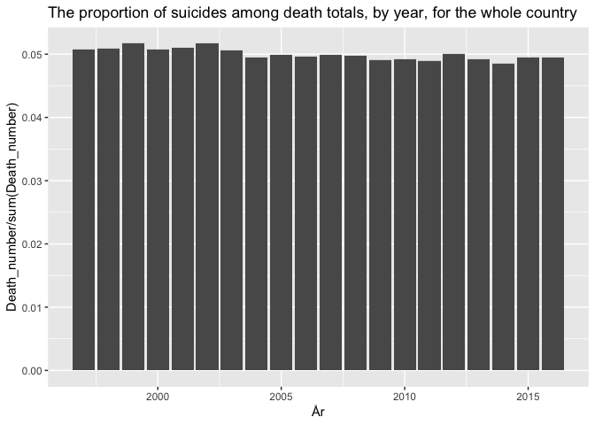

Class4
================

``` r
library(tidyverse)
```

    ## ── Attaching packages ────────────────────────────────────────────────────────────────── tidyverse 1.2.1 ──

    ## ✔ ggplot2 3.0.0     ✔ purrr   0.2.5
    ## ✔ tibble  1.4.2     ✔ dplyr   0.7.6
    ## ✔ tidyr   0.8.1     ✔ stringr 1.3.1
    ## ✔ readr   1.1.1     ✔ forcats 0.3.0

    ## ── Conflicts ───────────────────────────────────────────────────────────────────── tidyverse_conflicts() ──
    ## ✖ dplyr::filter() masks stats::filter()
    ## ✖ dplyr::lag()    masks stats::lag()

``` r
library(ggplot2)
```

The difference between read.csv and read\_csv: in read.csv string is converted into factor (stringAsFactor = TRUE by defaut) which decreases the dimension of data. To convert factor to numeric it is necessary to convert it into character first then to numeric. For example as.factor(c("1", "2", "5")) %&gt;% as.character() %&gt;% as.numeric()

``` r
dental_data <- read_csv2("Class_files/Statistikdatabasen_2018-01-23 14_46_26.csv", 
                         skip = 1, n_max = 580)
```

    ## Using ',' as decimal and '.' as grouping mark. Use read_delim() for more control.

    ## Parsed with column specification:
    ## cols(
    ##   Region = col_character(),
    ##   Kön = col_character(),
    ##   `2010` = col_integer(),
    ##   `2011` = col_integer(),
    ##   `2012` = col_integer(),
    ##   `2013` = col_integer(),
    ##   `2014` = col_integer(),
    ##   `2015` = col_integer(),
    ##   `2016` = col_integer()
    ## )

``` r
## skip = 1: skip the first line
## n_max = 580: the maximum number of the table to read
dental_data %>%
  gather(key = Year, value = Number, -Region, -Kön) %>%
  mutate(Year = as.numeric(Year)) %>%
  glimpse()
```

    ## Observations: 4,060
    ## Variables: 4
    ## $ Region <chr> "Upplands­Väsby", "Upplands­Väsby", "Vallentuna", "Vall...
    ## $ Kön    <chr> "Män", "Kvinnor", "Män", "Kvinnor", "Män", "Kvinnor", "...
    ## $ Year   <dbl> 2010, 2010, 2010, 2010, 2010, 2010, 2010, 2010, 2010, 2...
    ## $ Number <int> 8858, 10281, 7490, 8450, 10011, 11274, 9341, 10133, 164...

``` r
data <- read_csv2("Class_files/Statistikdatabasen_2018-01-23 15_04_12.csv", skip = 1, n_max = 80, na = " ")
```

    ## Using ',' as decimal and '.' as grouping mark. Use read_delim() for more control.

    ## Parsed with column specification:
    ## cols(
    ##   .default = col_integer(),
    ##   Diagnos = col_character(),
    ##   Kön = col_character(),
    ##   `Gotlands län` = col_character()
    ## )

    ## See spec(...) for full column specifications.

``` r
names(data) <- gsub(" ", "_", names(data))
glimpse(data)
```

    ## Observations: 80
    ## Variables: 24
    ## $ År                   <int> 2016, 2016, 2016, 2016, 2015, 2015, 2015,...
    ## $ Diagnos              <chr> "Samtliga dödsorsaker", "Samtliga dödsors...
    ## $ Kön                  <chr> "Män", "Kvinnor", "Män", "Kvinnor", "Män"...
    ## $ Stockholms_län       <int> 7604, 8336, 151, 66, 7646, 8210, 156, 74,...
    ## $ Uppsala_län          <int> 1375, 1374, 24, 13, 1349, 1407, 24, 13, 1...
    ## $ Södermanlands_län    <int> 1445, 1512, 19, 7, 1464, 1461, 31, 5, 138...
    ## $ Östergötlands_län    <int> 2082, 2168, 31, 17, 2039, 2121, 24, 10, 2...
    ## $ Jönköpings_län       <int> 1589, 1658, 28, 12, 1643, 1751, 30, 6, 16...
    ## $ Kronobergs_län       <int> 885, 897, 15, 6, 920, 928, 16, 7, 875, 87...
    ## $ Kalmar_län           <int> 1407, 1370, 33, 10, 1375, 1400, 24, 10, 1...
    ## $ Gotlands_län         <chr> "325", "316", "8", "2", "319", "310", "9"...
    ## $ Blekinge_län         <int> 919, 848, 23, 7, 824, 863, 20, 4, 858, 80...
    ## $ Skåne_län            <int> 5770, 6187, 88, 51, 5724, 6083, 111, 46, ...
    ## $ Hallands_län         <int> 1438, 1496, 29, 13, 1362, 1439, 22, 16, 1...
    ## $ Västra_Götalands_län <int> 7437, 7670, 134, 87, 7308, 7685, 165, 53,...
    ## $ Värmlands_län        <int> 1547, 1653, 24, 9, 1646, 1605, 32, 8, 149...
    ## $ Örebro_län           <int> 1468, 1534, 27, 8, 1497, 1445, 26, 9, 135...
    ## $ Västmanlands_län     <int> 1337, 1383, 25, 7, 1261, 1349, 22, 13, 12...
    ## $ Dalarnas_län         <int> 1524, 1630, 28, 4, 1584, 1594, 23, 13, 14...
    ## $ Gävleborgs_län       <int> 1509, 1645, 29, 13, 1629, 1746, 27, 15, 1...
    ## $ Västernorrlands_län  <int> 1422, 1457, 18, 6, 1465, 1553, 25, 7, 139...
    ## $ Jämtlands_län        <int> 692, 735, 18, 3, 730, 773, 12, 6, 738, 75...
    ## $ Västerbottens_län    <int> 1278, 1333, 11, 5, 1332, 1331, 18, 9, 127...
    ## $ Norrbottens_län      <int> 1432, 1384, 20, 5, 1423, 1402, 31, 6, 142...

``` r
data %>%
  mutate(Gotlands_län = str_replace_all(Gotlands_län, string = "0", pattern = " ")) %>% 
  mutate(Gotlands_län = as.integer(Gotlands_län)) %>%
  gather(key = County, value = Death_number, -År, -Diagnos, -Kön) %>%
  select(År, Death_number) %>%
  ggplot(aes(x = År, y = Death_number/sum(Death_number))) + geom_col() +
  ggtitle("The proportion of suicides among death totals, by year, for the whole country")
```



``` r
headers <- names(read_csv2("Class_files/Statistikdatabasen_2018-01-23 15_39_06.csv", skip = 1, n_max = 1))
```

    ## Using ',' as decimal and '.' as grouping mark. Use read_delim() for more control.

    ## Warning: Missing column names filled in: 'X1' [1], 'X2' [2]

    ## Warning: Duplicated column names deduplicated: '2014' => '2014_1' [4],
    ## '2014' => '2014_2' [5], '2014' => '2014_3' [6], '2014' => '2014_4' [7],
    ## '2014' => '2014_5' [8], '2014' => '2014_6' [9], '2014' => '2014_7' [10],
    ## '2014' => '2014_8' [11], '2014' => '2014_9' [12], '2014' => '2014_10' [13],
    ## '2014' => '2014_11' [14], '2015' => '2015_1' [16], '2015' =>
    ## '2015_2' [17], '2015' => '2015_3' [18], '2015' => '2015_4' [19], '2015' =>
    ## '2015_5' [20], '2015' => '2015_6' [21], '2015' => '2015_7' [22], '2015' =>
    ## '2015_8' [23], '2015' => '2015_9' [24], '2015' => '2015_10' [25], '2015' =>
    ## '2015_11' [26], '2016' => '2016_1' [28], '2016' => '2016_2' [29], '2016' =>
    ## '2016_3' [30], '2016' => '2016_4' [31], '2016' => '2016_5' [32], '2016' =>
    ## '2016_6' [33], '2016' => '2016_7' [34], '2016' => '2016_8' [35], '2016' =>
    ## '2016_9' [36], '2016' => '2016_10' [37], '2016' => '2016_11' [38], '2017'
    ## => '2017_1' [40], '2017' => '2017_2' [41], '2017' => '2017_3' [42], '2017'
    ## => '2017_4' [43], '2017' => '2017_5' [44], '2017' => '2017_6' [45], '2017'
    ## => '2017_7' [46], '2017' => '2017_8' [47], '2017' => '2017_9' [48], '2017'
    ## => '2017_10' [49], '2017' => '2017_11' [50]

    ## Parsed with column specification:
    ## cols(
    ##   .default = col_character()
    ## )
    ## See spec(...) for full column specifications.

``` r
df <- read_csv2("Class_files/Statistikdatabasen_2018-01-23 15_39_06.csv", skip = 2, n_max = 42)
```

    ## Using ',' as decimal and '.' as grouping mark. Use read_delim() for more control.

    ## Warning: Duplicated column names deduplicated: 'Januari' =>
    ## 'Januari_1' [15], 'Februari' => 'Februari_1' [16], 'Mars' => 'Mars_1' [17],
    ## 'April' => 'April_1' [18], 'Maj' => 'Maj_1' [19], 'Juni' => 'Juni_1' [20],
    ## 'Juli' => 'Juli_1' [21], 'Augusti' => 'Augusti_1' [22], 'September'
    ## => 'September_1' [23], 'Oktober' => 'Oktober_1' [24], 'November'
    ## => 'November_1' [25], 'December' => 'December_1' [26], 'Januari' =>
    ## 'Januari_2' [27], 'Februari' => 'Februari_2' [28], 'Mars' => 'Mars_2' [29],
    ## 'April' => 'April_2' [30], 'Maj' => 'Maj_2' [31], 'Juni' => 'Juni_2' [32],
    ## 'Juli' => 'Juli_2' [33], 'Augusti' => 'Augusti_2' [34], 'September'
    ## => 'September_2' [35], 'Oktober' => 'Oktober_2' [36], 'November'
    ## => 'November_2' [37], 'December' => 'December_2' [38], 'Januari' =>
    ## 'Januari_3' [39], 'Februari' => 'Februari_3' [40], 'Mars' => 'Mars_3' [41],
    ## 'April' => 'April_3' [42], 'Maj' => 'Maj_3' [43], 'Juni' => 'Juni_3' [44],
    ## 'Juli' => 'Juli_3' [45], 'Augusti' => 'Augusti_3' [46], 'September'
    ## => 'September_3' [47], 'Oktober' => 'Oktober_3' [48], 'November' =>
    ## 'November_3' [49], 'December' => 'December_3' [50]

    ## Parsed with column specification:
    ## cols(
    ##   .default = col_integer(),
    ##   Region = col_character(),
    ##   Mått = col_character(),
    ##   December_2 = col_character(),
    ##   Januari_3 = col_character(),
    ##   Februari_3 = col_character(),
    ##   November_3 = col_character(),
    ##   December_3 = col_character()
    ## )
    ## See spec(...) for full column specifications.

``` r
glimpse(df)
```

    ## Observations: 42
    ## Variables: 50
    ## $ Region      <chr> "Stockholms län", "Stockholms län", "Uppsala län",...
    ## $ Mått        <chr> "Antal hushåll", "Utbetalt ekonomiskt bistånd tkr"...
    ## $ Januari     <int> 19503, 151665, 4064, 30313, 5135, 33389, 7525, 541...
    ## $ Februari    <int> 19556, 153465, 4047, 30782, 5085, 33686, 7455, 526...
    ## $ Mars        <int> 19688, 155580, 4088, 30808, 5097, 34086, 7531, 531...
    ## $ April       <int> 19916, 158300, 4158, 31942, 5227, 35416, 7661, 560...
    ## $ Maj         <int> 19816, 155733, 4111, 31043, 5204, 34609, 7594, 544...
    ## $ Juni        <int> 19659, 155444, 4120, 31834, 5146, 34881, 7673, 556...
    ## $ Juli        <int> 19107, 150377, 4126, 31506, 5060, 32805, 7604, 557...
    ## $ Augusti     <int> 18802, 148534, 4093, 31335, 5031, 33014, 7458, 542...
    ## $ September   <int> 18508, 146770, 3963, 29993, 4843, 31928, 7110, 517...
    ## $ Oktober     <int> 19920, 158745, 3941, 30313, 4974, 33193, 7166, 522...
    ## $ November    <int> 19848, 157039, 3957, 30123, 5067, 33423, 7175, 515...
    ## $ December    <int> 20194, 165377, 4050, 30564, 5146, 34948, 7413, 539...
    ## $ Januari_1   <int> 19486, 153293, 4078, 31247, 5144, 33530, 7466, 534...
    ## $ Februari_1  <int> 19786, 158835, 4084, 31551, 5131, 33765, 7353, 527...
    ## $ Mars_1      <int> 19655, 158774, 4093, 31443, 4724, 30931, 7414, 527...
    ## $ April_1     <int> 19581, 158012, 4205, 31912, 5181, 34158, 7451, 532...
    ## $ Maj_1       <int> 19662, 159202, 4141, 31498, 5126, 33141, 7395, 527...
    ## $ Juni_1      <int> 19685, 160363, 4202, 32915, 5230, 34770, 7531, 545...
    ## $ Juli_1      <int> 19041, 153980, 4145, 32004, 5075, 32666, 7406, 540...
    ## $ Augusti_1   <int> 18949, 154540, 4177, 31876, 5097, 33701, 7292, 528...
    ## $ September_1 <int> 18585, 152899, 3999, 30686, 4793, 32259, 7017, 509...
    ## $ Oktober_1   <int> 18869, 154028, 4058, 31126, 4913, 32821, 7037, 512...
    ## $ November_1  <int> 18828, 153710, 4050, 31435, 4976, 33136, 7003, 505...
    ## $ December_1  <int> 18973, 158763, 4100, 31195, 4983, 34330, 7190, 523...
    ## $ Januari_2   <int> 18348, 151091, 4104, 32032, 5072, 34138, 7290, 534...
    ## $ Februari_2  <int> 18293, 152996, 4081, 32386, 4991, 34936, 7245, 541...
    ## $ Mars_2      <int> 18144, 150589, 4056, 32029, 4916, 34123, 7190, 532...
    ## $ April_2     <int> 18320, 151957, 4119, 32301, 4998, 34845, 7235, 543...
    ## $ Maj_2       <int> 18407, 153292, 4088, 33008, 5015, 35300, 7197, 541...
    ## $ Juni_2      <int> 18418, 153973, 4190, 34093, 4974, 35285, 7287, 551...
    ## $ Juli_2      <int> 17853, 146481, 4180, 33411, 4764, 32069, 7165, 530...
    ## $ Augusti_2   <int> 18011, 150673, 4273, 33941, 4902, 34444, 7195, 543...
    ## $ September_2 <int> 17666, 147663, 4211, 33026, 4541, 31836, 6790, 514...
    ## $ Oktober_2   <int> 18000, 151542, 4260, 34159, 4634, 32648, 6788, 510...
    ## $ November_2  <int> 18342, 154088, 4367, 35484, 4728, 33817, 6909, 521...
    ## $ December_2  <chr> "­­", "­­", "­­", "­­", "­­", "­­", "­­", "­­", "­...
    ## $ Januari_3   <chr> "­­", "­­", "­­", "­­", "­­", "­­", "­­", "­­", "­...
    ## $ Februari_3  <chr> "­­", "­­", "­­", "­­", "­­", "­­", "­­", "­­", "­...
    ## $ Mars_3      <int> 18496, 156115, 4618, 37522, 4810, 34872, 7008, 545...
    ## $ April_3     <int> 18718, 159623, 4722, 39078, 4793, 34753, 6966, 550...
    ## $ Maj_3       <int> 18371, 155866, 4754, 38289, 4750, 34926, 6906, 541...
    ## $ Juni_3      <int> 18229, 156303, 4815, 40177, 4693, 34444, 6900, 543...
    ## $ Juli_3      <int> 17708, 151850, 4726, 37404, 4554, 32451, 6698, 513...
    ## $ Augusti_3   <int> 17999, 156714, 4869, 39263, 4616, 34098, 6735, 540...
    ## $ September_3 <int> 17762, 152966, 4796, 38502, 4452, 32827, 6472, 512...
    ## $ Oktober_3   <int> 17992, 158534, 4761, 38558, 4555, 33748, 6535, 520...
    ## $ November_3  <chr> "­­", "­­", "­­", "­­", "­­", "­­", "­­", "­­", "­...
    ## $ December_3  <chr> "­­", "­­", "­­", "­­", "­­", "­­", "­­", "­­", "­...

``` r
names(df) <- paste(headers, names(df), sep = "_")

df_clean <- df %>%
  gather(key = Time, value = Number, -X1_Region, -X2_Mått) %>%
  spread(key = X2_Mått, value = Number)
names(df_clean) <- gsub(" ", "_", names(df_clean))
glimpse(df_clean)
```

    ## Observations: 1,008
    ## Variables: 4
    ## $ X1_Region                       <chr> "Blekinge län", "Blekinge län"...
    ## $ Time                            <chr> "2014_1_Februari", "2014_10_No...
    ## $ Antal_hushåll                   <chr> "1656", "1631", "1598", "1626"...
    ## $ Utbetalt_ekonomiskt_bistånd_tkr <chr> "11392", "10802", "10858", "10...

``` r
df_clean %>%
  separate(Time, c("Year", "n", "Month")) %>%
  select(X1_Region, Year, Month, Antal_hushåll, Utbetalt_ekonomiskt_bistånd_tkr) %>%
  mutate(Antal_hushåll = as.numeric(Antal_hushåll), 
         Utbetalt_ekonomiskt_bistånd_tkr = as.numeric(Utbetalt_ekonomiskt_bistånd_tkr)) %>%
  mutate(average = Utbetalt_ekonomiskt_bistånd_tkr/Antal_hushåll)
```

    ## Warning: Expected 3 pieces. Additional pieces discarded in 693 rows [13,
    ## 14, 15, 16, 17, 18, 19, 20, 21, 22, 23, 25, 26, 27, 28, 29, 30, 31, 32,
    ## 33, ...].

    ## Warning: Expected 3 pieces. Missing pieces filled with `NA` in 21 rows [12,
    ## 60, 108, 156, 204, 252, 300, 348, 396, 444, 492, 540, 588, 636, 684, 732,
    ## 780, 828, 876, 924, ...].

    ## Warning in evalq(as.numeric(Antal_hushåll), <environment>): NAs introduced
    ## by coercion

    ## Warning in evalq(as.numeric(Utbetalt_ekonomiskt_bistånd_tkr),
    ## <environment>): NAs introduced by coercion

    ## # A tibble: 1,008 x 6
    ##    X1_Region   Year  Month   Antal_hushåll Utbetalt_ekonomiskt_bi… average
    ##    <chr>       <chr> <chr>           <dbl>                   <dbl>   <dbl>
    ##  1 Blekinge l… 2014  Februa…          1656                   11392    6.88
    ##  2 Blekinge l… 2014  Novemb…          1631                   10802    6.62
    ##  3 Blekinge l… 2014  Decemb…          1598                   10858    6.79
    ##  4 Blekinge l… 2014  Mars             1626                   10912    6.71
    ##  5 Blekinge l… 2014  April            1624                   10930    6.73
    ##  6 Blekinge l… 2014  Maj              1630                   10862    6.66
    ##  7 Blekinge l… 2014  Juni             1692                   11477    6.78
    ##  8 Blekinge l… 2014  Juli             1617                   10946    6.77
    ##  9 Blekinge l… 2014  Augusti          1602                   10708    6.68
    ## 10 Blekinge l… 2014  Septem…          1523                   10288    6.76
    ## # ... with 998 more rows

``` r
math_data <- read_csv("Class_files/MM2001.csv", n_max = 1)
```

    ## Parsed with column specification:
    ## cols(
    ##   .default = col_character(),
    ##   Hskpoäng = col_double(),
    ##   Datum = col_date(format = ""),
    ##   `Total Hskpoäng` = col_double(),
    ##   Hskpoäng_1 = col_double(),
    ##   Datum_1 = col_date(format = ""),
    ##   Hskpoäng_2 = col_double(),
    ##   Datum_2 = col_date(format = ""),
    ##   Hskpoäng_3 = col_double(),
    ##   Datum_3 = col_date(format = ""),
    ##   Hskpoäng_4 = col_double(),
    ##   Datum_4 = col_date(format = ""),
    ##   Hskpoäng_5 = col_double(),
    ##   Datum_5 = col_date(format = ""),
    ##   Hskpoäng_6 = col_double(),
    ##   Datum_6 = col_date(format = ""),
    ##   Hskpoäng_7 = col_double(),
    ##   Datum_7 = col_date(format = ""),
    ##   Hskpoäng_8 = col_double(),
    ##   Datum_8 = col_date(format = ""),
    ##   Hskpoäng_9 = col_double()
    ##   # ... with 7 more columns
    ## )
    ## See spec(...) for full column specifications.

``` r
glimpse(math_data)
```

    ## Observations: 1
    ## Variables: 108
    ## $ Program          <chr> "NMATK"
    ## $ Inriktning       <chr> "_"
    ## $ Kursreg          <chr> "H14"
    ## $ Kurskod          <chr> "MM2001"
    ## $ Hskpoäng         <dbl> 30
    ## $ `TG-hskpoäng`    <chr> NA
    ## $ Betyg            <chr> "C"
    ## $ Datum            <date> 2015-05-29
    ## $ `Total Hskpoäng` <dbl> 30
    ## $ Stjärna          <chr> "*"
    ## $ Provkod          <chr> "M101"
    ## $ Hskpoäng_1       <dbl> 1.5
    ## $ `TG-hskpoäng_1`  <chr> NA
    ## $ Betyg_1          <chr> "G"
    ## $ Spec             <chr> NA
    ## $ Datum_1          <date> 2014-09-24
    ## $ Projekttitel     <chr> NA
    ## $ Provkod_1        <chr> "M102"
    ## $ Hskpoäng_2       <dbl> 1.5
    ## $ `TG-hskpoäng_2`  <chr> NA
    ## $ Betyg_2          <chr> "G"
    ## $ Spec_1           <chr> NA
    ## $ Datum_2          <date> 2014-10-15
    ## $ Projekttitel_1   <chr> NA
    ## $ Provkod_2        <chr> "M103"
    ## $ Hskpoäng_3       <dbl> 1.5
    ## $ `TG-hskpoäng_3`  <chr> NA
    ## $ Betyg_3          <chr> "G"
    ## $ Spec_2           <chr> NA
    ## $ Datum_3          <date> 2014-10-29
    ## $ Projekttitel_2   <chr> NA
    ## $ Provkod_3        <chr> "M104"
    ## $ Hskpoäng_4       <dbl> 7.5
    ## $ `TG-hskpoäng_4`  <chr> NA
    ## $ Betyg_4          <chr> "D"
    ## $ Spec_3           <chr> NA
    ## $ Datum_4          <date> 2015-05-09
    ## $ Projekttitel_3   <chr> NA
    ## $ Provkod_4        <chr> "M105"
    ## $ Hskpoäng_5       <dbl> 1.5
    ## $ `TG-hskpoäng_5`  <chr> NA
    ## $ Betyg_5          <chr> "G"
    ## $ Spec_4           <chr> NA
    ## $ Datum_5          <date> 2015-02-11
    ## $ Projekttitel_4   <chr> NA
    ## $ Provkod_5        <chr> "M106"
    ## $ Hskpoäng_6       <dbl> 1.5
    ## $ `TG-hskpoäng_6`  <chr> NA
    ## $ Betyg_6          <chr> "G"
    ## $ Spec_5           <chr> NA
    ## $ Datum_6          <date> 2015-03-04
    ## $ Projekttitel_5   <chr> NA
    ## $ Provkod_6        <chr> "M107"
    ## $ Hskpoäng_7       <dbl> 1.5
    ## $ `TG-hskpoäng_7`  <chr> NA
    ## $ Betyg_7          <chr> "G"
    ## $ Spec_6           <chr> NA
    ## $ Datum_7          <date> 2015-03-18
    ## $ Projekttitel_6   <chr> NA
    ## $ Provkod_7        <chr> "M108"
    ## $ Hskpoäng_8       <dbl> 7.5
    ## $ `TG-hskpoäng_8`  <chr> NA
    ## $ Betyg_8          <chr> "C"
    ## $ Spec_7           <chr> NA
    ## $ Datum_8          <date> 2015-05-19
    ## $ Projekttitel_7   <chr> NA
    ## $ Provkod_8        <chr> "M115"
    ## $ Hskpoäng_9       <dbl> 1.5
    ## $ `TG-hskpoäng_9`  <chr> NA
    ## $ Betyg_9          <chr> "G"
    ## $ Spec_8           <chr> NA
    ## $ Datum_9          <date> 2015-01-09
    ## $ Projekttitel_8   <chr> NA
    ## $ Provkod_9        <chr> "M116"
    ## $ Hskpoäng_10      <dbl> 1.5
    ## $ `TG-hskpoäng_10` <chr> NA
    ## $ Betyg_10         <chr> "G"
    ## $ Spec_9           <chr> NA
    ## $ Datum_10         <date> 2015-05-21
    ## $ Projekttitel_9   <chr> NA
    ## $ Provkod_10       <chr> "M117"
    ## $ Hskpoäng_11      <dbl> 1.5
    ## $ `TG-hskpoäng_11` <chr> NA
    ## $ Betyg_11         <chr> "G"
    ## $ Spec_10          <chr> NA
    ## $ Datum_11         <date> 2015-01-28
    ## $ Projekttitel_10  <chr> NA
    ## $ Provkod_11       <chr> "M118"
    ## $ Hskpoäng_12      <dbl> 1.5
    ## $ `TG-hskpoäng_12` <chr> NA
    ## $ Betyg_12         <chr> "G"
    ## $ Spec_11          <chr> NA
    ## $ Datum_12         <date> 2015-05-29
    ## $ Projekttitel_11  <chr> NA
    ## $ Provkod_12       <chr> NA
    ## $ Hskpoäng_13      <chr> NA
    ## $ `TG-hskpoäng_13` <chr> NA
    ## $ Betyg_13         <chr> NA
    ## $ Spec_12          <chr> NA
    ## $ Datum_13         <chr> NA
    ## $ Projekttitel_12  <chr> NA
    ## $ Provkod_13       <chr> NA
    ## $ Hskpoäng_14      <chr> NA
    ## $ `TG-hskpoäng_14` <chr> NA
    ## $ Betyg_14         <chr> NA
    ## $ Spec_13          <chr> NA
    ## $ Datum_14         <chr> NA
    ## $ Projekttitel_13  <chr> NA

``` r
math_data <- tibble::rowid_to_column(math_data, "ID")

math_data %>%
  gather(key, value, 11:108) %>%
  str()
```

    ## Warning: attributes are not identical across measure variables;
    ## they will be dropped

    ## Classes 'tbl_df', 'tbl' and 'data.frame':    98 obs. of  13 variables:
    ##  $ ID             : int  1 1 1 1 1 1 1 1 1 1 ...
    ##  $ Program        : chr  "NMATK" "NMATK" "NMATK" "NMATK" ...
    ##  $ Inriktning     : chr  "_" "_" "_" "_" ...
    ##  $ Kursreg        : chr  "H14" "H14" "H14" "H14" ...
    ##  $ Kurskod        : chr  "MM2001" "MM2001" "MM2001" "MM2001" ...
    ##  $ Hskpoäng       : num  30 30 30 30 30 30 30 30 30 30 ...
    ##  $ TG-hskpoäng    : chr  NA NA NA NA ...
    ##  $ Betyg          : chr  "C" "C" "C" "C" ...
    ##  $ Datum          : Date, format: "2015-05-29" "2015-05-29" ...
    ##  $ Total Hskpoäng : num  30 30 30 30 30 30 30 30 30 30 ...
    ##  $ Projekttitel_13: chr  NA NA NA NA ...
    ##  $ key            : chr  "Stjärna" "Provkod" "Hskpoäng_1" "TG-hskpoäng_1" ...
    ##  $ value          : chr  "*" "M101" "1.5" NA ...
