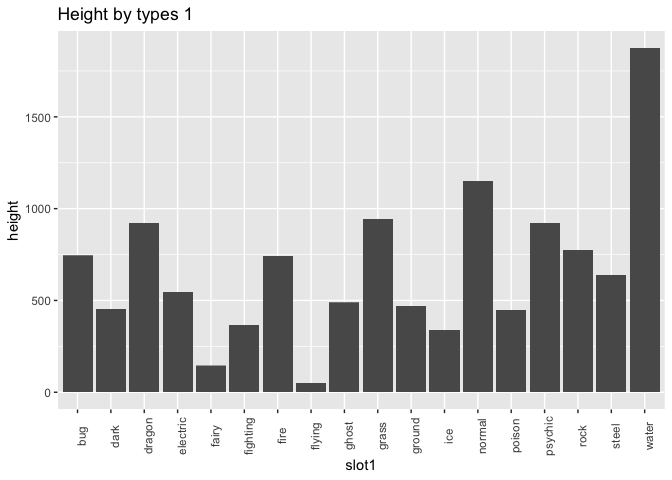
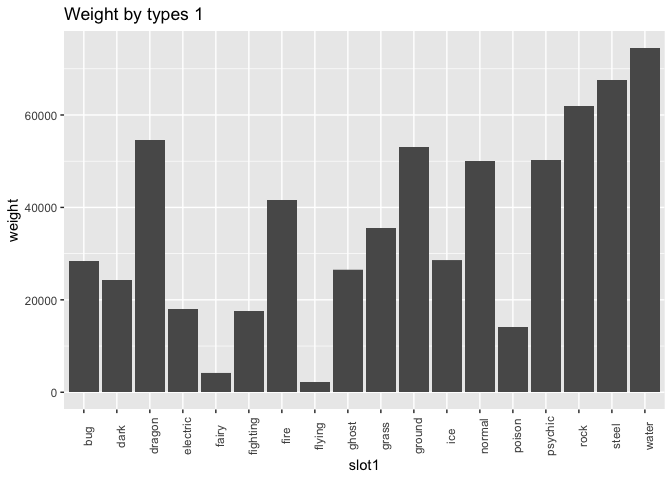
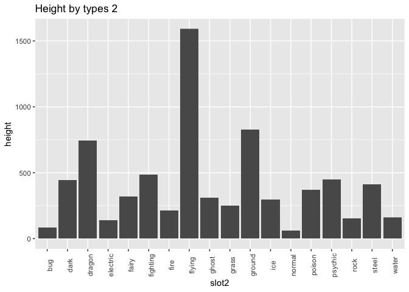
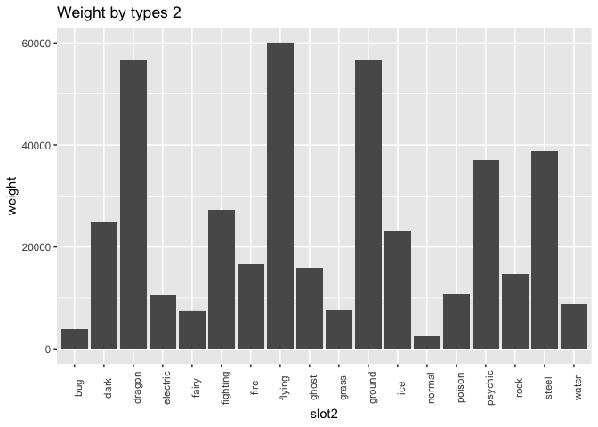

Class 5: Relational data and dplyr joins
================

Thi Thuy Nga Nguyen

More dental care
================

During last class you worked with records of adults visiting dental care, join this with Class\_files/BE0101A5.csv, containing population numbers, and compute number of visits per capita.

``` r
dental_data <- read_csv2("Class_files/Statistikdatabasen_2018-01-23 14_46_26.csv", skip = 1, n_max = 580)
population <- read_csv2("Class_files/BE0101A5.csv", ";")
```

haven't completed
-----------------

Systembolaget
=============

Construct A data-frame of beverages that have been added since 2018-10-08 (i.e. beverages in the new file that are not present in Class\_files/systembolaget2018-10-08.csv).

A data-frame of beverages that have been removed since 2018-10-08.

Any particular types of beverages that has been added/removed?

``` r
source("Class_files/Systembolaget.R")

systembolaget_old <- read_csv("Class_files/systembolaget2018-10-08.csv")
glimpse(systembolaget_old)
```

    ## Observations: 17,591
    ## Variables: 30
    ## $ nr                 <int> 101, 7548901, 7774701, 7563901, 7521801, 89...
    ## $ Artikelid          <int> 1, 1000008, 1000080, 1000083, 1000131, 1000...
    ## $ Varnummer          <int> 1, 75489, 77747, 75639, 75218, 89366, 87805...
    ## $ Namn               <chr> "Renat", "Valtellina Superiore", "Canella",...
    ## $ Namn2              <chr> NA, "Sassella Riserva", "Valdobbiadene Pros...
    ## $ Prisinklmoms       <dbl> 204.0, 339.0, 147.0, 159.0, 181.0, 26.7, 37...
    ## $ Volymiml           <dbl> 700, 750, 750, 750, 750, 330, 700, 1000, 70...
    ## $ PrisPerLiter       <dbl> 291.43, 452.00, 196.00, 212.00, 241.33, 80....
    ## $ Saljstart          <date> 1993-10-01, 2015-09-01, 2015-09-01, 2015-0...
    ## $ Utgått             <int> 0, 0, 0, 0, 0, 0, 0, 0, 0, 0, 0, 0, 0, 0, 0...
    ## $ Varugrupp          <chr> "Vodka och Brännvin", "Rött vin", "Moussera...
    ## $ Typ                <chr> "Vodka", NA, "Vitt Torrt", "Fylligt & Smakr...
    ## $ Stil               <chr> NA, NA, NA, NA, NA, "Modern stil", NA, NA, ...
    ## $ Forpackning        <chr> "Flaska", "Flaska", "Flaska", "Flaska", "Fl...
    ## $ Forslutning        <chr> NA, NA, NA, "Natur", NA, NA, NA, NA, NA, "B...
    ## $ Ursprung           <chr> NA, "Lombardiet", "Venetien", "Rioja", NA, ...
    ## $ Ursprunglandnamn   <chr> "Sverige", "Italien", "Italien", "Spanien",...
    ## $ Producent          <chr> "Pernod Ricard", "Arpepe", "Canella SpA", "...
    ## $ Leverantor         <chr> "Pernod Ricard Sweden AB", "Vinoliv Import ...
    ## $ Argang             <int> NA, 2011, 2014, 2006, 2015, NA, NA, NA, NA,...
    ## $ Provadargang       <chr> NA, NA, NA, NA, NA, NA, NA, NA, NA, NA, NA,...
    ## $ Alkoholhalt        <chr> "37.50%", "13.50%", "11.00%", "12.00%", "13...
    ## $ Sortiment          <chr> "FS", "BS", "BS", "BS", "BS", "BS", "BS", "...
    ## $ SortimentText      <chr> "Ordinarie sortiment", "Övrigt sortiment", ...
    ## $ Ekologisk          <int> 0, 0, 0, 0, 0, 0, 0, 0, 0, 0, 0, 0, 0, 0, 0...
    ## $ Etiskt             <int> 0, 0, 0, 0, 0, 0, 0, 0, 0, 0, 0, 0, 0, 0, 0...
    ## $ Koscher            <int> 0, 0, 0, 0, 0, 0, 0, 0, 0, 0, 0, 0, 0, 0, 0...
    ## $ RavarorBeskrivning <chr> "Säd.", NA, NA, "Viura.", NA, NA, NA, NA, N...
    ## $ Pant               <dbl> NA, NA, NA, NA, NA, NA, NA, NA, NA, NA, NA,...
    ## $ EtisktEtikett      <chr> NA, NA, NA, NA, NA, NA, NA, NA, NA, NA, NA,...

``` r
systembolaget_new <- read_csv("systembolaget2018-11-19.csv")
glimpse(systembolaget_new)
```

    ## Observations: 17,697
    ## Variables: 30
    ## $ nr                 <int> 101, 7548901, 7774701, 7563901, 7521801, 89...
    ## $ Artikelid          <int> 1, 1000008, 1000080, 1000083, 1000131, 1000...
    ## $ Varnummer          <int> 1, 75489, 77747, 75639, 75218, 89366, 87805...
    ## $ Namn               <chr> "Renat", "Valtellina Superiore", "Canella",...
    ## $ Namn2              <chr> NA, "Sassella Riserva", "Valdobbiadene Pros...
    ## $ Prisinklmoms       <dbl> 204.0, 339.0, 147.0, 159.0, 181.0, 26.7, 37...
    ## $ Volymiml           <dbl> 700, 750, 750, 750, 750, 330, 700, 1000, 70...
    ## $ PrisPerLiter       <dbl> 291.43, 452.00, 196.00, 212.00, 241.33, 80....
    ## $ Saljstart          <date> 1993-10-01, 2015-09-01, 2015-09-01, 2015-0...
    ## $ Utgått             <int> 0, 0, 0, 0, 0, 0, 0, 0, 0, 0, 0, 0, 0, 0, 0...
    ## $ Varugrupp          <chr> "Vodka och Brännvin", "Rött vin", "Moussera...
    ## $ Typ                <chr> "Vodka", NA, "Vitt Torrt", "Fylligt & Smakr...
    ## $ Stil               <chr> NA, NA, NA, NA, NA, "Modern stil", NA, NA, ...
    ## $ Forpackning        <chr> "Flaska", "Flaska", "Flaska", "Flaska", "Fl...
    ## $ Forslutning        <chr> NA, NA, NA, "Natur", NA, NA, NA, NA, NA, "B...
    ## $ Ursprung           <chr> NA, "Lombardiet", "Venetien", "Rioja", NA, ...
    ## $ Ursprunglandnamn   <chr> "Sverige", "Italien", "Italien", "Spanien",...
    ## $ Producent          <chr> "Pernod Ricard", "Arpepe", "Canella SpA", "...
    ## $ Leverantor         <chr> "Pernod Ricard Sweden AB", "Vinoliv Import ...
    ## $ Argang             <int> NA, 2011, 2014, 2006, 2015, NA, NA, NA, NA,...
    ## $ Provadargang       <chr> NA, NA, NA, NA, NA, NA, NA, NA, NA, NA, NA,...
    ## $ Alkoholhalt        <chr> "37.50%", "13.50%", "11.00%", "12.00%", "13...
    ## $ Sortiment          <chr> "FS", "BS", "BS", "BS", "BS", "BS", "BS", "...
    ## $ SortimentText      <chr> "Ordinarie sortiment", "Övrigt sortiment", ...
    ## $ Ekologisk          <int> 0, 0, 0, 0, 0, 0, 0, 0, 0, 0, 0, 0, 0, 0, 0...
    ## $ Etiskt             <int> 0, 0, 0, 0, 0, 0, 0, 0, 0, 0, 0, 0, 0, 0, 0...
    ## $ Koscher            <int> 0, 0, 0, 0, 0, 0, 0, 0, 0, 0, 0, 0, 0, 0, 0...
    ## $ RavarorBeskrivning <chr> "Säd.", NA, NA, "Viura.", NA, NA, NA, NA, N...
    ## $ Pant               <dbl> NA, NA, NA, NA, NA, NA, NA, NA, NA, NA, NA,...
    ## $ EtisktEtikett      <chr> NA, NA, NA, NA, NA, NA, NA, NA, NA, NA, NA,...

``` r
setdiff(systembolaget_new, systembolaget_old)
```

    ## # A tibble: 1,922 x 30
    ##        nr Artikelid Varnummer Namn  Namn2 Prisinklmoms Volymiml
    ##     <int>     <int>     <int> <chr> <chr>        <dbl>    <dbl>
    ##  1 7.04e6   1006376     70436 Sain… Doma…          329      750
    ##  2 8.28e6     10066     82831 Doma… Gigo…          216      750
    ##  3 7.30e6   1007984     72993 Doma… Poin…          179      750
    ##  4 7.45e6   1008900     74461 Preu… Cabe…          115      750
    ##  5 7.56e6   1010813     75613 Rånä… Rico…          129      750
    ##  6 7.03e6   1012235     70333 Muro… Alva…          199      750
    ##  7 9.61e6  10122356     96142 Cape… Marq…          189      750
    ##  8 9.58e6  10122436     95790 Marq… Gran…          299      750
    ##  9 9.61e6  10134240     96145 Lioc… Char…          349      750
    ## 10 9.55e6  10134308     95463 LIOC… Save…          495      750
    ## # ... with 1,912 more rows, and 23 more variables: PrisPerLiter <dbl>,
    ## #   Saljstart <date>, Utgått <int>, Varugrupp <chr>, Typ <chr>,
    ## #   Stil <chr>, Forpackning <chr>, Forslutning <chr>, Ursprung <chr>,
    ## #   Ursprunglandnamn <chr>, Producent <chr>, Leverantor <chr>,
    ## #   Argang <int>, Provadargang <chr>, Alkoholhalt <chr>, Sortiment <chr>,
    ## #   SortimentText <chr>, Ekologisk <int>, Etiskt <int>, Koscher <int>,
    ## #   RavarorBeskrivning <chr>, Pant <dbl>, EtisktEtikett <chr>

``` r
setdiff(systembolaget_old, systembolaget_new)
```

    ## # A tibble: 1,816 x 30
    ##        nr Artikelid Varnummer Namn  Namn2 Prisinklmoms Volymiml
    ##     <int>     <int>     <int> <chr> <chr>        <dbl>    <dbl>
    ##  1 8.91e6   1000827     89140 Harv… Blac…         25.7      330
    ##  2 7.45e6   1001022     74470 Exce… Rese…        119        750
    ##  3 8.78e6   1004734     87804 Auch… Sele…       1487        700
    ##  4 8.77e6   1004761     87683 Allt… Sele…       1448        700
    ##  5 8.79e6   1004816     87875 Stra… Sing…        856        700
    ##  6 3.07e6   1004940     30677 Södr… <NA>          39.7      330
    ##  7 7.04e6   1006376     70436 Sain… Doma…        329        750
    ##  8 8.28e6     10066     82831 Doma… Gigo…        216        750
    ##  9 7.30e6   1007984     72993 Doma… Poin…        179        750
    ## 10 7.45e6   1008900     74461 Preu… Cabe…        115        750
    ## # ... with 1,806 more rows, and 23 more variables: PrisPerLiter <dbl>,
    ## #   Saljstart <date>, Utgått <int>, Varugrupp <chr>, Typ <chr>,
    ## #   Stil <chr>, Forpackning <chr>, Forslutning <chr>, Ursprung <chr>,
    ## #   Ursprunglandnamn <chr>, Producent <chr>, Leverantor <chr>,
    ## #   Argang <int>, Provadargang <chr>, Alkoholhalt <chr>, Sortiment <chr>,
    ## #   SortimentText <chr>, Ekologisk <int>, Etiskt <int>, Koscher <int>,
    ## #   RavarorBeskrivning <chr>, Pant <dbl>, EtisktEtikett <chr>

``` r
systembolaget_new %>%
  anti_join(systembolaget_old) %>%
  select(Typ) %>%
  unique()
```

    ## # A tibble: 61 x 1
    ##    Typ                
    ##    <chr>              
    ##  1 <NA>               
    ##  2 Fylligt & Smakrikt 
    ##  3 Kryddigt & Mustigt 
    ##  4 Friskt & Fruktigt  
    ##  5 Tequila            
    ##  6 Vitt Torrt         
    ##  7 Fruktigt & Smakrikt
    ##  8 Ljus lager         
    ##  9 Mellanmörk lager   
    ## 10 Brandy             
    ## # ... with 51 more rows

``` r
systembolaget_old %>%
  anti_join(systembolaget_new) %>%
  select(Typ) %>%
  unique()
```

    ## # A tibble: 59 x 1
    ##    Typ                         
    ##    <chr>                       
    ##  1 Ale brittisk-amerikansk stil
    ##  2 <NA>                        
    ##  3 Maltwhisky                  
    ##  4 Grainwhisky                 
    ##  5 Porter och stout            
    ##  6 Friskt & Fruktigt           
    ##  7 Kryddigt & Mustigt          
    ##  8 Ale oklassificerat          
    ##  9 Ljus lager                  
    ## 10 Tequila                     
    ## # ... with 49 more rows

Pokemon
=======

We can e.g. see that Pokemon no 1 (bulbasaur) is of type 12 (grass) and type 4 (poison). Join the tables, aiming for a full table like poke\_table below and investigate how height or weight depends on type.

``` r
pokemon <- read_csv("https://raw.githubusercontent.com/veekun/pokedex/master/pokedex/data/csv/pokemon.csv")
head(pokemon)
```

    ## # A tibble: 6 x 8
    ##      id identifier species_id height weight base_experience order
    ##   <int> <chr>           <int>  <int>  <int>           <int> <int>
    ## 1     1 bulbasaur           1      7     69              64     1
    ## 2     2 ivysaur             2     10    130             142     2
    ## 3     3 venusaur            3     20   1000             236     3
    ## 4     4 charmander          4      6     85              62     5
    ## 5     5 charmeleon          5     11    190             142     6
    ## 6     6 charizard           6     17    905             240     7
    ## # ... with 1 more variable: is_default <int>

``` r
types <- read_csv("https://raw.githubusercontent.com/veekun/pokedex/master/pokedex/data/csv/types.csv")
head(types)
```

    ## # A tibble: 6 x 4
    ##      id identifier generation_id damage_class_id
    ##   <int> <chr>              <int>           <int>
    ## 1     1 normal                 1               2
    ## 2     2 fighting               1               2
    ## 3     3 flying                 1               2
    ## 4     4 poison                 1               2
    ## 5     5 ground                 1               2
    ## 6     6 rock                   1               2

``` r
pokemon_types <- read_csv("https://raw.githubusercontent.com/veekun/pokedex/master/pokedex/data/csv/pokemon_types.csv")
head(pokemon_types)
```

    ## # A tibble: 6 x 3
    ##   pokemon_id type_id  slot
    ##        <int>   <int> <int>
    ## 1          1      12     1
    ## 2          1       4     2
    ## 3          2      12     1
    ## 4          2       4     2
    ## 5          3      12     1
    ## 6          3       4     2

``` r
pokemon_table <- pokemon %>%
  left_join(pokemon_types, by = c("id" = "pokemon_id")) %>%
  left_join(types, by = c("type_id" = "id")) %>%
  select(id, identifier.x, slot, identifier.y, height, weight) %>%
  spread(key = slot, value = identifier.y)
names(pokemon_table) <- c("id", "identifier", "height", "weight", "slot1", "slot2")
head(pokemon_table)
```

    ## # A tibble: 6 x 6
    ##      id identifier height weight slot1 slot2 
    ##   <int> <chr>       <int>  <int> <chr> <chr> 
    ## 1     1 bulbasaur       7     69 grass poison
    ## 2     2 ivysaur        10    130 grass poison
    ## 3     3 venusaur       20   1000 grass poison
    ## 4     4 charmander      6     85 fire  <NA>  
    ## 5     5 charmeleon     11    190 fire  <NA>  
    ## 6     6 charizard      17    905 fire  flying

``` r
ggplot(pokemon_table, aes(x = slot1, y = height)) + geom_col() + 
  theme(axis.text.x = element_text(angle = 90)) + 
  ggtitle("Height by types 1")
```



``` r
ggplot(pokemon_table, aes(x = slot1, y = weight)) + geom_col() + 
  theme(axis.text.x = element_text(angle = 90)) + 
  ggtitle("Weight by types 1")
```



``` r
ggplot(data = subset(pokemon_table, !is.na(slot2)), aes(x = slot2, y = height)) + geom_col() + 
  theme(axis.text.x = element_text(angle = 90)) + 
  ggtitle("Height by types 2")  
```



``` r
ggplot(data = subset(pokemon_table, !is.na(slot2)), aes(x = slot2, y = weight)) + geom_col() + 
  theme(axis.text.x = element_text(angle = 90)) + 
  ggtitle("Weight by types 2")
```



More birdwatching
=================

Do birdwatchers stay home when it is raining? The file Class\_files/smhi-opendata\_5\_98210\_20181112\_125314.csv contains daily precipitation from SMHI. Join this with the species\_data from HW2 in order to investigate whether the observers are less active during rainy days. Note that there are strong unrelated seasonal components in both data sets. For example, both rainfall and recording activity tends to be low in summer months.

``` r
species_data <- read_csv("SpeciesObservations-2018-11-07-14-23-54.csv")
names(species_data) <- gsub(" ", "_", names(species_data))
precipitation_data <- read_csv2("Class_files/smhi-opendata_5_98210_20181112_125314.csv")
```

haven't completed
-----------------
