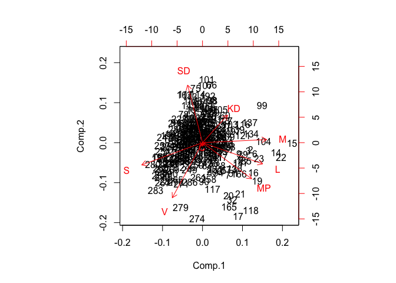
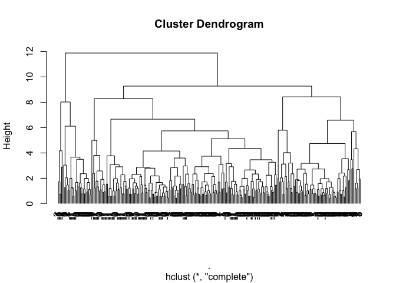
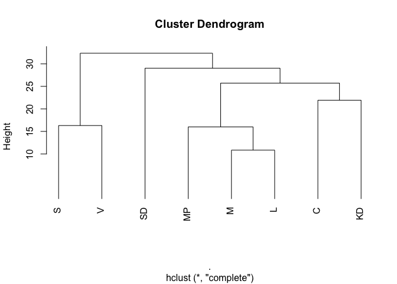
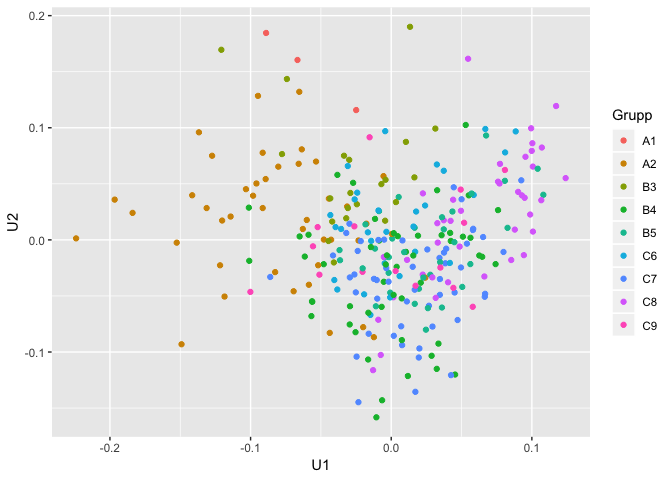
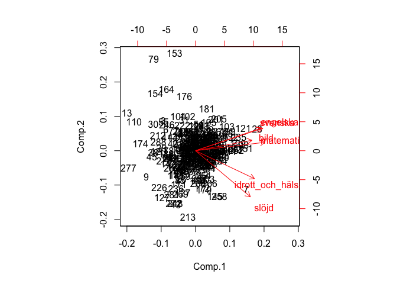
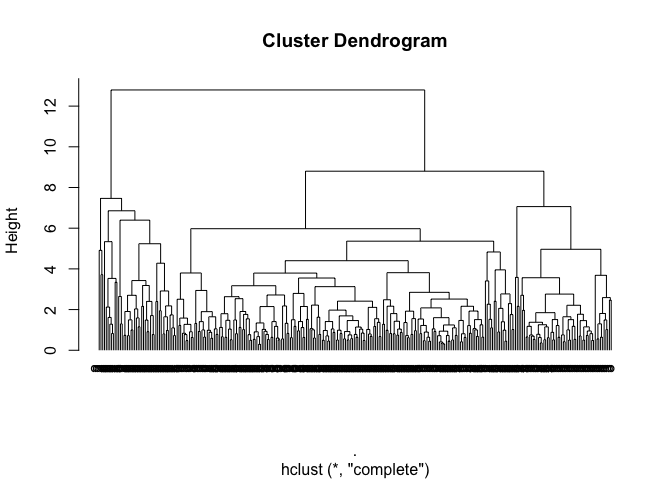
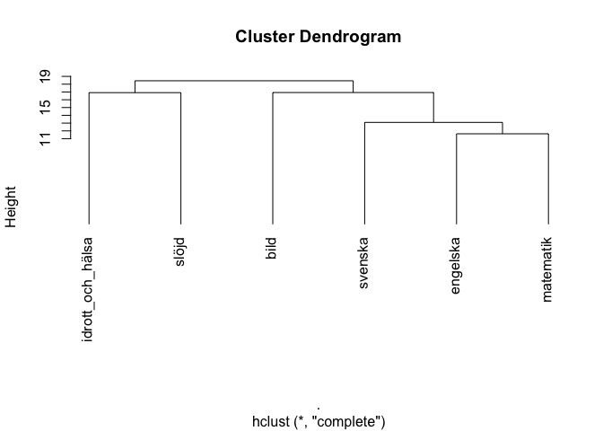
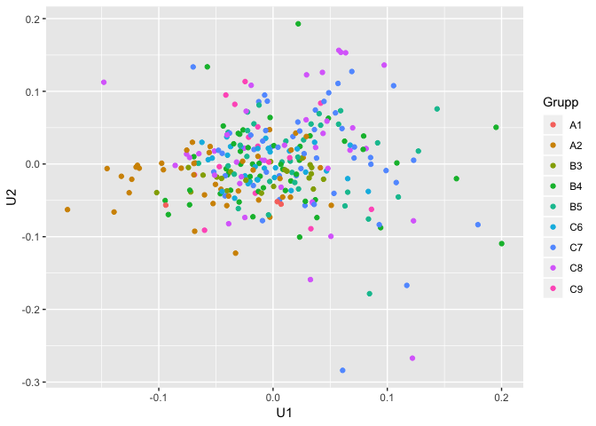

Class 8: Highdimensional data: Principal components and clusters
================

Nga Nguyen

``` r
library(tidyverse)
```

    ## ── Attaching packages ──────────────────────────────────────────────────────────────────────── tidyverse 1.2.1 ──

    ## ✔ ggplot2 3.0.0     ✔ purrr   0.2.5
    ## ✔ tibble  1.4.2     ✔ dplyr   0.7.6
    ## ✔ tidyr   0.8.1     ✔ stringr 1.3.1
    ## ✔ readr   1.1.1     ✔ forcats 0.3.0

    ## ── Conflicts ─────────────────────────────────────────────────────────────────────────── tidyverse_conflicts() ──
    ## ✖ dplyr::filter() masks stats::filter()
    ## ✖ dplyr::lag()    masks stats::lag()

1.  Find the similar obsevations:

Glyphs::stars(): visualize

DescTools:PlotFaces()

HeatMap: apply for more dimensions and more observations than 2 aboves

Covariation: GGally::scatmat(), Lines, corrplot::corrplot: correlation plot

### Election 2018

``` r
election_data <- read_csv2("Class_files/2018_R_per_kommun.csv")
```

    ## Using ',' as decimal and '.' as grouping mark. Use read_delim() for more control.

    ## Parsed with column specification:
    ## cols(
    ##   .default = col_double(),
    ##   LÄNSKOD = col_integer(),
    ##   KOMMUNKOD = col_integer(),
    ##   LÄNSNAMN = col_character(),
    ##   KOMMUNNAMN = col_character(),
    ##   Gup = col_integer(),
    ##   `RÖSTER GILTIGA` = col_integer(),
    ##   RÖSTANDE = col_integer(),
    ##   RÖSTBERÄTTIGADE = col_integer()
    ## )

    ## See spec(...) for full column specifications.

``` r
glimpse(election_data)
```

    ## Observations: 290
    ## Variables: 45
    ## $ LÄNSKOD          <int> 1, 1, 1, 1, 1, 1, 1, 1, 1, 1, 1, 1, 1, 1, 1, ...
    ## $ KOMMUNKOD        <int> 14, 15, 17, 20, 23, 25, 26, 27, 28, 36, 38, 3...
    ## $ LÄNSNAMN         <chr> "Stockholms län", "Stockholms län", "Stockhol...
    ## $ KOMMUNNAMN       <chr> "Upplands Väsby", "Vallentuna", "Österåker", ...
    ## $ M                <dbl> 23.11, 28.29, 29.68, 27.49, 23.96, 28.12, 24....
    ## $ C                <dbl> 6.26, 10.11, 9.35, 9.76, 6.31, 11.24, 7.52, 5...
    ## $ L                <dbl> 5.66, 7.73, 7.48, 6.40, 6.04, 7.64, 6.14, 4.3...
    ## $ KD               <dbl> 6.71, 7.58, 7.13, 5.89, 6.29, 7.85, 5.35, 8.1...
    ## $ S                <dbl> 26.97, 18.91, 19.71, 20.48, 27.68, 17.17, 26....
    ## $ V                <dbl> 8.01, 4.47, 4.97, 6.02, 8.75, 4.76, 8.63, 9.8...
    ## $ MP               <dbl> 3.92, 4.85, 4.44, 5.41, 4.54, 5.70, 5.32, 3.8...
    ## $ SD               <dbl> 18.04, 16.63, 16.09, 17.19, 15.00, 16.21, 15....
    ## $ FI               <dbl> 0.37, 0.27, 0.30, 0.36, 0.34, 0.34, 0.49, 0.4...
    ## $ AfS              <dbl> 0.31, 0.37, 0.27, 0.29, 0.33, 0.35, 0.42, 0.2...
    ## $ BASIP            <dbl> NA, NA, NA, 0.00, NA, 0.01, 0.01, 0.04, 0.01,...
    ## $ CSIS             <dbl> NA, NA, NA, NA, NA, NA, NA, NA, NA, NA, NA, N...
    ## $ DD               <dbl> 0.09, 0.10, 0.05, 0.07, 0.08, 0.10, 0.10, 0.0...
    ## $ DjuP             <dbl> 0.04, 0.10, 0.02, 0.07, 0.03, 0.03, 0.04, 0.1...
    ## $ EAP              <dbl> NA, NA, NA, NA, NA, NA, 0.00, 0.00, NA, NA, 0...
    ## $ ENH              <dbl> 0.04, 0.10, 0.09, 0.15, 0.05, 0.04, 0.05, 0.0...
    ## $ FHS              <dbl> NA, NA, NA, NA, NA, NA, NA, NA, NA, NA, NA, N...
    ## $ Gup              <int> NA, NA, NA, NA, NA, NA, NA, NA, NA, NA, NA, N...
    ## $ INI              <dbl> NA, 0.01, 0.01, 0.02, 0.01, 0.01, 0.02, 0.02,...
    ## $ KLP              <dbl> 0.02, 0.01, NA, 0.01, 0.01, 0.02, 0.04, 0.00,...
    ## $ KrVP             <dbl> 0.07, NA, 0.00, 0.04, 0.17, 0.04, 0.06, 0.11,...
    ## $ LPo              <dbl> 0.01, 0.03, 0.00, 0.01, 0.01, NA, 0.00, 0.01,...
    ## $ MED              <dbl> 0.19, 0.25, 0.31, 0.24, 0.21, 0.31, 0.29, 0.1...
    ## $ NMR              <dbl> 0.08, 0.06, 0.02, 0.03, 0.04, 0.01, 0.03, 0.0...
    ## $ NORRP            <dbl> NA, NA, NA, NA, NA, NA, NA, NA, NA, NA, NA, N...
    ## $ NYREF            <dbl> NA, NA, NA, NA, 0.00, NA, 0.00, 0.01, NA, 0.0...
    ## $ PP               <dbl> 0.07, 0.10, 0.05, 0.04, 0.10, 0.04, 0.13, 0.1...
    ## $ RNP              <dbl> NA, NA, NA, NA, NA, NA, NA, NA, NA, NA, NA, N...
    ## $ `S-FRP`          <dbl> 0.02, NA, NA, NA, 0.01, 0.01, NA, NA, NA, 0.0...
    ## $ SKP              <dbl> 0.01, 0.00, 0.02, 0.00, 0.03, 0.01, 0.01, 0.0...
    ## $ SKÅ              <dbl> NA, NA, NA, NA, NA, NA, NA, NA, NA, NA, NA, N...
    ## $ TRP              <dbl> NA, 0, NA, NA, 0, NA, NA, NA, NA, 0, NA, NA, ...
    ## $ `VL-S`           <dbl> NA, NA, NA, NA, NA, NA, NA, NA, NA, NA, NA, N...
    ## $ ÖVR              <dbl> NA, 0.00, 0.01, 0.01, 0.02, 0.01, 0.01, 0.06,...
    ## $ OGEJ             <dbl> 0.04, 0.02, 0.03, 0.04, 0.04, 0.01, 0.04, 0.0...
    ## $ BLANK            <dbl> 0.69, 0.59, 0.69, 0.67, 0.53, 0.64, 0.58, 0.6...
    ## $ OG               <dbl> 0.06, 0.08, 0.13, 0.07, 0.07, 0.08, 0.07, 0.0...
    ## $ `RÖSTER GILTIGA` <int> 25830, 20952, 27711, 28115, 45654, 17814, 614...
    ## $ RÖSTANDE         <int> 26036, 21099, 27947, 28335, 45948, 17946, 618...
    ## $ RÖSTBERÄTTIGADE  <int> 30740, 23438, 31309, 31371, 53230, 19472, 728...
    ## $ VALDELTAGANDE    <dbl> 84.70, 90.02, 89.26, 90.32, 86.32, 92.16, 84....

``` r
names(election_data) <- gsub(" ", "_", names(election_data))
names(election_data) <- gsub("-", "_", names(election_data))

X <- scale(election_data[ , 5:12])
head(X)
```

    ##             M           C         L          KD          S          V
    ## [1,] 1.048960 -1.02861251 0.8497289 -0.03167492 -0.4782512  0.5414342
    ## [2,] 2.011190  0.26831905 2.0109296  0.32429759 -1.6494028 -0.8404527
    ## [3,] 2.269395  0.01230139 1.8706880  0.14017388 -1.5331595 -0.6452709
    ## [4,] 1.862583  0.15041618 1.2648441 -0.36718924 -1.4212753 -0.2353892
    ## [5,] 1.206855 -1.01176924 1.0628962 -0.20352372 -0.3750852  0.8303033
    ## [6,] 1.979611  0.64897688 1.9604426  0.43477181 -1.9022321 -0.7272473
    ##            MP         SD
    ## [1,] 0.644948 -0.5317682
    ## [2,] 1.350711 -0.7914725
    ## [3,] 1.039568 -0.8909337
    ## [4,] 1.775687 -0.6883275
    ## [5,] 1.115457 -1.0916980
    ## [6,] 1.995764 -0.8688312

``` r
pc.X <- princomp(X)
biplot(pc.X)
```



``` r
# KD closes to SD and V distant to SD
X %>%
  dist() %>%
  hclust() %>%
  plot(labels = round(X[, 6]), hang = -1) # label by MP
```



``` r
X %>%
  t() %>%
  dist() %>%
  hclust() %>%
  plot(hang = -1)
```



``` r
municipalities <- read_csv2("Class_files/Kommungruppsindelning_2017.csv")
```

    ## Using ',' as decimal and '.' as grouping mark. Use read_delim() for more control.

    ## Warning: Missing column names filled in: 'X11' [11], 'X12' [12]

    ## Parsed with column specification:
    ## cols(
    ##   Grupp = col_character(),
    ##   Kommunkod = col_character(),
    ##   `Kommun namn` = col_character(),
    ##   `Huvudgrupp kod` = col_character(),
    ##   `Huvudgrupp namn` = col_character(),
    ##   `Kommungrupp kod` = col_integer(),
    ##   `Kommungrupp 2017 namn` = col_character(),
    ##   Länskod = col_character(),
    ##   `Län namn` = col_character(),
    ##   `Landsting/region namn` = col_character(),
    ##   X11 = col_character(),
    ##   X12 = col_character()
    ## )

``` r
names(municipalities) <- gsub(" ", "_", names(municipalities))
names(municipalities) <- gsub("/", "_", names(municipalities))
glimpse(municipalities)
```

    ## Observations: 290
    ## Variables: 12
    ## $ Grupp                 <chr> "A1", "A1", "A1", "A2", "A2", "A2", "A2"...
    ## $ Kommunkod             <chr> "0180", "1280", "1480", "0114", "0115", ...
    ## $ Kommun_namn           <chr> "Stockholm", "Malmö", "Göteborg", "Uppla...
    ## $ Huvudgrupp_kod        <chr> "A", "A", "A", "A", "A", "A", "A", "A", ...
    ## $ Huvudgrupp_namn       <chr> "Storstäder och storstadsnära kommuner",...
    ## $ Kommungrupp_kod       <int> 1, 1, 1, 2, 2, 2, 2, 2, 2, 2, 2, 2, 2, 2...
    ## $ Kommungrupp_2017_namn <chr> "Storstäder", "Storstäder", "Storstäder"...
    ## $ Länskod               <chr> "01", "12", "14", "01", "01", "01", "01"...
    ## $ Län_namn              <chr> "Stockholms län", "Region Skåne", "Västr...
    ## $ Landsting_region_namn <chr> "Stockholms läns landsting", "Region Skå...
    ## $ X11                   <chr> NA, NA, NA, NA, NA, NA, NA, NA, NA, NA, ...
    ## $ X12                   <chr> NA, NA, NA, NA, NA, NA, NA, NA, NA, NA, ...

``` r
u <- svd(X)$u

election_data %>%
  mutate(LÄNSKOD = formatC(LÄNSKOD, width = 2, flag = "0"),
         KOMMUNKOD = formatC(KOMMUNKOD, width = 2, flag = "0")) %>%
  unite(KOD, LÄNSKOD, KOMMUNKOD, sep = "") %>%  # mutate(KOD = paste(formatC(LÄNSKOD, width = 2, flag = "0"), formatC(KOMMUNKOD, width = 2, flag = "0"), sep = ""))
  left_join(municipalities, by = c("KOD" = "Kommunkod")) %>%
  mutate(U1 = u[, 1], U2 = u[, 2]) %>%
  ggplot(aes(x = U1, y = U2, color = Grupp)) + geom_point()
```



There seems to be a relation between voting patterns and classification, Grupp A2 seems distributing in the left hand side of the plot while A1 is up, B3 is left and up B4 is from center to bottom, C8 is in the right ...

### 6 graders

``` r
avg_grade <- read_csv("Class_files/betyg.csv")
```

    ## Parsed with column specification:
    ## cols(
    ##   kod = col_character(),
    ##   kommun = col_character(),
    ##   bild = col_double(),
    ##   engelska = col_double(),
    ##   `idrott och hälsa` = col_double(),
    ##   matematik = col_double(),
    ##   svenska = col_double(),
    ##   slöjd = col_double()
    ## )

``` r
names(avg_grade) <- gsub(" ", "_", names(avg_grade))
glimpse(avg_grade)
```

    ## Observations: 290
    ## Variables: 8
    ## $ kod              <chr> "1440", "1489", "0764", "0604", "1984", "2506...
    ## $ kommun           <chr> "Ale", "Alingsås", "Alvesta", "Aneby", "Arbog...
    ## $ bild             <dbl> 13.8, 14.2, 12.5, 11.5, 13.6, 9.9, 15.9, 14.1...
    ## $ engelska         <dbl> 14.7, 14.1, 11.6, 12.6, 13.3, 12.3, 14.5, 13....
    ## $ idrott_och_hälsa <dbl> 15.1, 13.9, 11.7, 13.9, 12.9, 13.2, 17.1, 14....
    ## $ matematik        <dbl> 13.5, 12.8, 10.9, 13.3, 12.7, 12.6, 14.1, 12....
    ## $ svenska          <dbl> 14.3, 13.8, 12.6, 13.6, 12.4, 12.6, 14.1, 13....
    ## $ slöjd            <dbl> 14.1, 13.3, 11.6, 14.2, 14.1, 11.2, 15.6, 13....

``` r
summary(avg_grade)
```

    ##      kod               kommun               bild          engelska    
    ##  Length:290         Length:290         Min.   : 9.90   Min.   : 9.80  
    ##  Class :character   Class :character   1st Qu.:13.00   1st Qu.:12.60  
    ##  Mode  :character   Mode  :character   Median :13.50   Median :13.30  
    ##                                        Mean   :13.44   Mean   :13.28  
    ##                                        3rd Qu.:14.00   3rd Qu.:14.00  
    ##                                        Max.   :17.10   Max.   :16.70  
    ##  idrott_och_hälsa   matematik        svenska          slöjd      
    ##  Min.   : 8.40    Min.   : 8.00   Min.   : 8.40   Min.   : 9.60  
    ##  1st Qu.:13.20    1st Qu.:11.30   1st Qu.:12.40   1st Qu.:12.90  
    ##  Median :13.90    Median :12.25   Median :13.00   Median :13.40  
    ##  Mean   :13.84    Mean   :12.14   Mean   :12.91   Mean   :13.31  
    ##  3rd Qu.:14.50    3rd Qu.:12.80   3rd Qu.:13.50   3rd Qu.:13.90  
    ##  Max.   :17.10    Max.   :15.50   Max.   :15.40   Max.   :16.10

``` r
X = scale(avg_grade[, -c(1:2)])
biplot(princomp(X))
```



``` r
X %>%
  dist() %>%
  hclust() %>%
  plot(labels = round(avg_grade$matematik/5), hang = -1) 
```



``` r
X %>%
  t() %>%
  dist() %>%
  hclust() %>%
  plot(hang = -1)
```



``` r
u <- svd(X)$u
avg_grade %>%
  left_join(municipalities, by = c("kod" = "Kommunkod")) %>%
  mutate(U1 = u[, 1], U2 = u[, 2]) %>%
  ggplot(aes(x = U1, y = U2, color = Grupp)) + geom_point()
```


