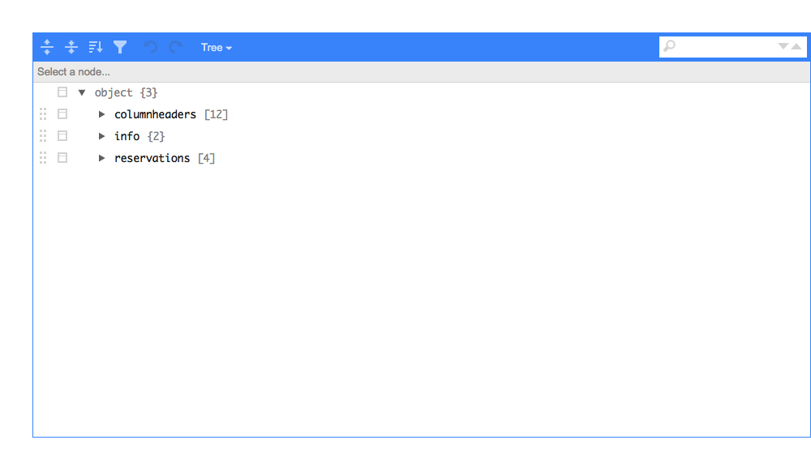
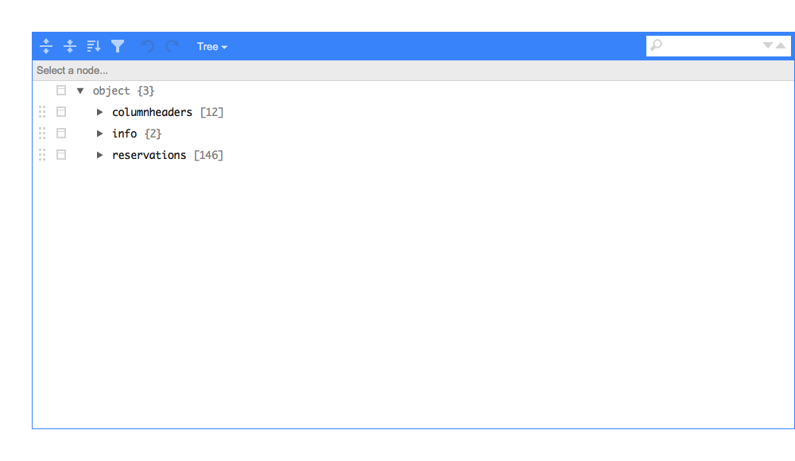
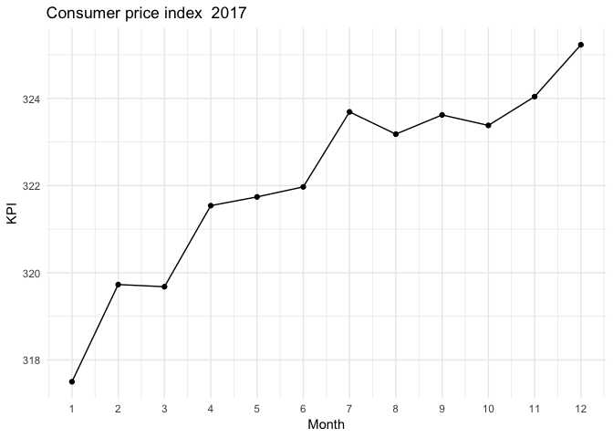

Class 9: Collecting data from internet
================

Thi Thuy Nga Nguyen

a-pi
====

Create a function that calls a-pi and returns the digits of π from start to start + numberOfDigits - 1. A sample call is <https://api.pi.delivery/v1/pi?start=1000&numberOfDigits=5>.

``` r
get_pi <- function(start, numberOfDigits){
  reponse <- GET("https://api.pi.delivery/v1/pi", query = list(start = start, numberOfDigits = numberOfDigits))
  if(http_error(reponse)){
    stop("the request failed")
  }
  content(reponse)
}
get_pi(1, 10)
```

    ## $content
    ## [1] ".141592653"

TimeEdit
========

``` r
schema_response <- GET("https://cloud.timeedit.net/su/web/stud1/ri157XQQ624Z50Qv27083gZ6y2Y7007Q5Y65Y5.json")
schema_json <- content(schema_response, "text")
jsonedit(schema_json)
```



We convert it with fromJSON and choose the reservations

``` r
schema_df <- fromJSON(schema_json)$reservations

schema_df %>% 
  mutate(sal = map_chr(columns, 3), 
         kurs = map_chr(columns, 1), 
         tid = paste(starttime, endtime, sep = " - ")) %>% 
  select(kurs, datum = startdate, tid, sal) %>% 
  kable()
```

| kurs   | datum      | tid           | sal                      |
|:-------|:-----------|:--------------|:-------------------------|
| MT5013 | 2018-12-13 | 09:15 - 12:00 | Sal 22. Kräftriket hus 5 |
| MT5013 | 2018-12-21 | 14:00 - 17:00 | Sal 36. Kräftriket hus 5 |
| MT5013 | 2019-01-11 | 09:15 - 12:00 | Sal 32. Kräftriket hus 5 |
| MT5013 | 2019-01-15 | 09:00 - 16:00 | Sal 14. Kräftriket hus 5 |

``` r
room14_response <- GET("https://cloud.timeedit.net/su/web/stud1/ri107355X07Z07Q5Z76g0Y40y6076Y31Q09gQY5Q54777.json")
room14_json <- content(room14_response, "text")
jsonedit(room14_json)
```



``` r
room14_df <- fromJSON(room14_json)$reservations
room14_df %>% 
  mutate(sal = map_chr(columns, 3), 
         teacher = map_chr(columns, 5), 
         tid = paste(starttime, endtime, sep = " - ")) %>% 
  select(teacher, datum = startdate, tid, sal) %>%
  filter(teacher != "") %>%
  group_by(teacher) %>%
  summarize(number = n()) %>%
  arrange(desc(number)) %>%
  kable()
```

| teacher                         |  number|
|:--------------------------------|-------:|
| Anders Hagberg                  |      33|
| Torbjörn Tambour                |      17|
| Dan Petersen                    |      14|
| Yishao Zhou                     |      12|
| Wushi Goldring                  |       7|
| Anna Montaruli                  |       5|
| Pavel Kurasov                   |       4|
| Tom Britton                     |       4|
| Håkan Granath                   |       3|
| Ola G H Hössjer                 |       3|
| Peter LeFanu Lumsdaine          |       3|
| Erik Palmgren                   |       2|
| Felix Wahl, Måns Karlsson       |       2|
| Helena Flinck                   |       2|
| Mitja Nedic                     |       2|
| Samuel Lundqvist                |       2|
| Theresa Stocks                  |       2|
| Annemarie Luger                 |       1|
| Benjamin Allévius, Martin Sköld |       1|
| Filip Lindskog                  |       1|
| Gabriele Balletti               |       1|
| Jacopo Emmenegger               |       1|
| Jonathan Rohleder               |       1|
| Kristofer Lindensjö             |       1|
| Lukas Runsäter                  |       1|
| Mathias Millberg Lindholm       |       1|
| Sara Woldegiorgis               |       1|

SCB
===

### Example

Grab KPI from SCB API

``` r
query <-
  "{
\"query\": [],
\"response\": {
\"format\": \"json\"
}
}"
KPI_url <- "http://api.scb.se/OV0104/v1/doris/sv/ssd/START/PR/PR0101/PR0101A/KPIFastM2"
response <- POST(url = KPI_url, body = query)
json <- content(response, "text")
test <- fromJSON(json) # check data

KPI_data <- fromJSON(json)$data %>% 
  separate(key, into = c("Year", "Month"), sep = "M") %>% 
  rename(KPI = values) %>% 
  mutate(KPI = as.numeric(unlist(KPI)))
```

Plot KPI

``` r
year <-  2017
filter(KPI_data, Year == year) %>% 
  ggplot(aes(x = as.numeric(Month), y = KPI)) + 
  geom_point() + geom_line() +
  scale_x_continuous(name = "Month", breaks = 1:12) +
  ggtitle(paste("Consumer price index ", year)) +
  theme_minimal()
```



Try fetching a table with httr::POST, the query should be placed in the body.

Latest day at Bromma
====================
